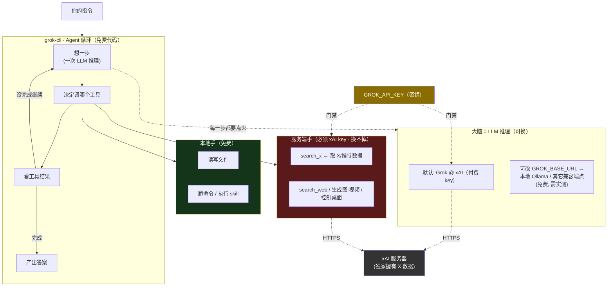

# grok-cli 工作原理与「xAI key 边界」——第一性原理拆解

> 关联：[ADR 0012](../adr/0012-x-twitter-via-grok-cli.md)（X/推特资讯源经 grok-cli 接入）。
> 本文回答一个常被误解的问题：**没有 xAI 付费 key，grok-cli 是不是就完全没法用、skill 也不能用？**
> 结论：**不能一刀切**——要把「大脑」和「服务端工具」分开看。图见文末 mermaid 源；渲染版：[静态图解](../reference/devhtml/grok-cli-key边界-图解.html) · [交互版(archify，可缩放/追踪/导出)](../reference/devhtml/grok-cli-key边界-archify.html)。

## 一句话结论

| 能力 | 没有 xAI 付费 key 时 | 为什么 |
|---|---|---|
| **agent 外壳 / 改文件 / 跑 skill / 本地工具** | ⚠️ 换个「大脑」可跑 | grok-cli 留了 `GROK_BASE_URL` + `GROK_MODEL` 口子，理论上能把大脑指向别的模型（本地 Ollama / 其它 OpenAI 兼容端点）。官方未承诺任意端点都兼容，需实测。 |
| **`search_x`（取 X/推特实时数据）** | ❌ 真的没法用，无替代 | 这是 **xAI 服务端的专有工具**，不是 CLI 自己算的。X 数据是 xAI 的护城河（xAI 拥有 X），换任何别的模型都拿不到。 |

对**本工作台的用途（就是要取 X 数据）**：**没 xAI 付费 key = X 源点不亮，没有免费替代。**

## 第一性原理：一个 LLM CLI Agent 靠什么跑

拆到不能再拆，grok-cli = **大脑 + 手 + 循环** 三件套：

1. **大脑（Brain）= LLM 推理**。agent 每一步「读需求→想该干嘛→决定调哪个工具→看结果→再想」，每一次「想」都是一次模型推理（消耗 token）。**没有大脑，循环第一步就停**。默认大脑 = Grok（跑在 xAI，付费）。
2. **手（Hands）= 工具**，分两种——这是理解付费边界的关键：
   - **本地手**：读写文件、跑命令、执行 skill 指令——在本机跑，**不花钱**，只要大脑能驱动它。
   - **服务端手**：`search_x`、`search_web`、生成图/视频、控制桌面、语音转写——**跑在 xAI 服务器上**，由 `GROK_API_KEY` 计费 + 门禁，**换不掉**。
3. **循环（Loop）= 编排**。把「大脑想→手做→观察」接成反复迭代的圈，直到任务完成。循环本身是免费代码，但每转一圈都要点火大脑。

**skill 是什么？** 就是一包「给大脑读的说明书 + 配套指令」。skill 自己不需要 xAI，但要靠**大脑**读懂并驱动**手**执行。所以：只要给了能用的大脑，skill 就能跑；但如果某个 skill 内部要调 `search_x` / 生成图，那一步照样撞 xAI 收费墙。

**关键推论**：`GROK_API_KEY` 同时卡住两处——① 默认大脑（Grok@xAI，可换）；② **全部服务端手（换不掉）**。所以「没 key 就全废」不准确：换掉大脑，本地手 + skill 能跑；但服务端手（含 `search_x`）永远需要 xAI。

## 落到本工作台

- 我们要的是 **X 数据**，走的正是服务端手 `search_x` → **必须 xAI 付费 key，没有免费路**（爬 X 违规且脆、官方 API 免费档几乎不能读，对比见 [ADR 0012](../adr/0012-x-twitter-via-grok-cli.md) 背景）。
- 集成已做**优雅降级**：没配 key → X 源自动跳过、其余工作台照常（`backend/clients/grok.py::configured()` 返 False）。
- **省钱退路**：把引擎从「包整个 grok-cli」换成「直连 xAI x_search（Responses API `/v1/responses`）」——同一份 X 数据、少一层 Bun+agent 开销；但**便宜 ≠ 免费**，一样吃 xAI 额度。

## 如何开通 xAI key + 价格（2026-09 快照，以 [x.ai/api](https://x.ai/api) 当前为准）

**开通四步**：① 打开 [console.x.ai](https://console.x.ai) 用邮箱/X 账号注册；② 建 team + 绑定信用卡；③ API Keys → Create API Key；④ **key 只显示一次**，立刻复制（xAI 不存明文）。注册通常送 **$25 试用额度**（活动为准），用完按量付费。拿到后填 `workbench.local.json` 的 `grokApiKey`。

**模型 token 费**（每百万 token）：

| 模型 | 输入 | 缓存输入 | 输出 | 说明 |
|---|---|---|---|---|
| Grok 4.6（旗舰） | $2.00 | $0.50 | $6.00 | 提示 ≥200K token 整单涨到 $4 / $1 / $12 |
| Grok 4.3 / 4.20 系列 | $1.25 | — | $2.50 | 便宜不少 |
| Grok Build 0.1（编码向） | $1.00 | — | $2.00 | 最省 |

**工具费（X 数据吃这块，在 token 费之上另收）**：
- **X Search**：当前 $5 / 1000 次调用；**2026-09-21 起改为 $5 / 1000 条帖子 + $10 / 1000 个用户资料**。
- Web Search / 代码执行：各 $5 / 1000 次。

**工作台成本估算**：grok-cli 每次取数 = 一整轮 Agent（多次推理 + 搜索）。按默认（2 词 × ~12 帖 × **每小时**刷 = 720 次/月）粗估：搜索费 ≈ $86/月 + token 费 ≈ $50~120/月 = **约 $130~200/月**（⚠ 不便宜）。**四个降本杠杆**：① **降频**（改每天 1~2 次 → ~几美元/月，最有效）；② `GROK_MODEL` 换 Grok 4.3 / Build 0.1；③ 精简 `x.queries` / 调小 `fetch_x.py` 的 `PER_QUERY`；④ 切「直连 xAI x_search（Responses API）」省掉 Agent 多轮 token 开销。

> 来源：[mem0 定价梳理](https://mem0.ai/blog/xai-grok-api-pricing) · [x.ai/api](https://x.ai/api) · [docs.x.ai 快速开始](https://docs.x.ai/developers/quickstart) · [BenchLM 定价](https://benchlm.ai/xai/api-pricing)。价格随时变，务必以官网当前为准。

## 图（mermaid 源）

