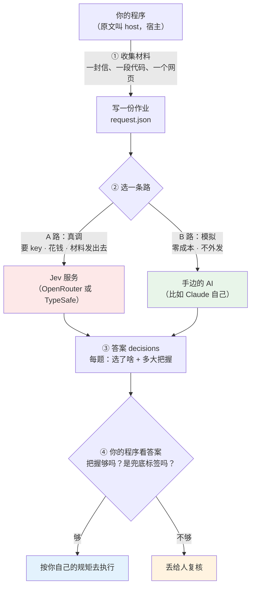

# jev 判断层 · 原理

> 性质：设计说明（explanation）——讲清一套第三方 skill 是什么、怎么运转、什么时候**不**该用。
> 上位：无（本仓尚未在生产里采用它，这是理解性留档）；关联：[jev零成本上手-指南](../guides/jev零成本上手-指南.md)（照着敲的那份）、[jev原理图解.html](../reference/devhtml/jev原理图解.html)（一页图）。
> 这篇回答：2026-09-22 装进 `.claude/skills/` 的 jev 全家桶到底是个什么东西，它替我们省了什么事，代价是什么。

> **取材声明**：全文只依据 2026-09-22 落盘在本仓 `.claude/skills/jev/`、`jev-act/`、`jev-documents/`、`jev-eval/`、`jev-triage/` 下的原文（`SKILL.md`、`references/*.md`、`assets/*.json`、`scripts/jev.py`），每条关键结论都标了出处文件。**原文没写清的，一律进 §8「原文没说的事」，不猜**。文中所有命令都在本机真跑过，输出是真实粘贴的。

---

## 1 · 没有它的时候，人是怎么受苦的

设想你在管一个客服邮箱，每天两百封信。你要对每一封做三件事：

1. 这封该转给谁（物流组？退款组？）
2. 这人是不是在要钱
3. 这事有多急，今天办还是排队

这三件事都**不需要写一个字**，只需要**拿个主意**。但它们又都不是简单的关键词匹配能搞定的——「我不想再付这个钱了」没有出现「退款」两个字，可它就是在要退款。

现在你想让 AI 帮你干。你会怎么做？大概率是写一段话丢给 ChatGPT 这类**会聊天的 AI**：「请判断下面这封信属于哪一类，是否要求退款，紧急程度打 1 到 3 分，用 JSON 回答我。」

这么干能work，但有四个烦人的地方，每一个都真实存在：

| 烦人的地方 | 具体表现 |
|---|---|
| **它话多** | 你要一个词，它给你一段「根据您提供的信息，我认为这封邮件……」，你还得写代码把答案从废话里抠出来 |
| **它会跑偏** | 明明只有三个选项，它给你编第四个，或者回一句「这取决于具体情况」 |
| **它不肯说不知道** | 信息明明不够，它也硬答一个，而且答得很笃定 |
| **你不知道它有多确定** | 它说「属于退款类」，是九成把握还是五成？看不出来。于是你没法定规矩说「没把握的挑出来给人看」 |

两百封信 × 每天 = 这四件事会一直烦你。**jev 要解决的就是这个**。

---

## 2 · 一句话说它是什么

> **jev 是一个「只会做选择题的 AI」，外加一套教你怎么出题的说明书。**

土味比喻：你手下有两种人。

- 一个是**能写会说的秘书**（就是普通的大模型，比如 Claude 本身）——能写文章、能查资料、能干活，但你问他一个是非题，他能给你回三百字。
- 另一个是**只会填答题卡的阅卷员**（这就是 Jev）——你给他一份材料和一张答题卡，他只会在 A/B/C 里涂一个、在「是/否」里涂一个、在 1-3 分里涂一个。**不会写作文，不会查资料，不记得你昨天问过什么**。但他涂得又快又便宜，而且会告诉你「这道题我有多少把握」。

装进本仓的那五个目录，就是**一个阅卷员 + 四种考法**，不是五个独立工具（`jev/references/guide.md` §Choose the workflow）：

| 目录 | 它是什么 | 一句话 |
|---|---|---|
| `jev/` | **总纲** | 怎么出题、怎么配置、怎么跑；另外四个都从这儿延伸 |
| `jev-triage/` | 考法①：**分类** | 一堆邮件/工单，挨个判归属和优先级 |
| `jev-documents/` | 考法②：**找证据** | 在一份文档里指出「哪一段才是答案」，或者判断某句话有没有出处支持 |
| `jev-eval/` | 考法③：**评判** | 看一份已经做好的东西（比如一段代码改动）合不合格 |
| `jev-act/` | 考法④：**选下一步** | 在浏览器/游戏里，从「当前能点的按钮」里挑一个 |

原文的原话是：这些是**模式（modes）**，不是额外装的东西（`jev/references/guide.md` §Choose the workflow：「these are modes, not extra installed skills」）。

---

## 3 · 原理：一次判断，东西是怎么流动的

Jev 的世界里只有三样东西：**材料（state）**、**题目（questions）**、**答案（decisions）**。



三个必须记住的细节：

**① 作业只有三个格子。** 一份 `request.json` 顶层**只允许** `model`、`state`、`questions` 三个字段，多写一个直接报错（`jev/scripts/jev.py` 的 `validate_request()`，报错原文：`Supported request fields: model, state, questions`）。

**② 它什么都不记得。** 原文反复强调：「Jev does not inherit the host's context」——它看不见你的聊天记录、看不见你的文件、看不见你上一次问了什么（`jev/references/context-and-throughput.md` §Make every request self-contained）。**每份作业都必须自带全部材料**。这是它和聊天 AI 最本质的区别。

**③ 它只认字。** Jev 是纯文本的：网页的文字内容可以喂给它，**截图不行**——图得先由别的工具转成文字（`jev/references/api.md` §Native request）。

### 三种题型，用一个 9 行的真实例子讲透

本仓 `jev/assets/prompt-to-jev.json` 是所有样本里**唯一一份同时出现三种题型**的，内容是一封客服信：「我的订阅被扣了两次钱，请把重复的那笔退给我。服务我还能正常用。」

针对这一封信，它同时问了三道题：

| 题型 | 原文叫法 | 这道题问什么 | 答案长什么样 |
|---|---|---|---|
| **选择题** | `choice` | 「这封信该给哪个组？」给了三个选项：billing（账单）/ access（登录）/ other（都不是或看不懂） | 三选一 |
| **是非题** | `noul` | 「这封信有没有明确要求退钱？」 | true / false |
| **打分题** | `score` | 「这事多大程度上妨碍了客户干活？」给了三档描述：①还能正常用，没耽误事 ②有影响，但有别的办法顶着 ③完全没法干活了 | 0 / 1 / 2（**从 0 开始数**，见 `jev/references/api.md` §Questions and answers） |

这里有两个设计上的讲究，值得单独说：

- **选项里一定要留一个「都不是」**。上面 choice 的第三个选项 `other` 就是干这个的。原文的说法是：要包含 `none` / `insufficient_evidence` / `delegate` 这样的兜底项，「when the supplied choices may not fit」（`jev/references/question-design.md` §1）。不留兜底，等于逼它在错误答案里挑一个。
- **一道题只问一件事**。原文明确反对这么问：「这个 agent 是否安全、合规、完成了、可以上线了？」——四个问题捆在一起，答案没法用。应该拆成几道独立的是非题（`jev/references/question-design.md` §3）。

**打分题的档位描述必须是「有序的、能落地的」**：不能写「1 分=不急，2 分=比较急，3 分=很急」（这是循环定义），要写成上面那样「还能不能干活」的客观状态。

---

## 4 · 怎么用：从零到第一次跑通

**结论先行：本机现在就能零成本跑通第一步，但有个坑。**

五份 SKILL.md 里教的命令都长这样：

```bash
jev-decide decide <skill-dir>/assets/example.json --dry-run
```

**这条命令在本机跑不了**——`jev-decide` 这个程序没装，而且**原文从头到尾没有说它怎么装**（详见 §8）。

好消息是不影响你上手：这套 skill 自带一个 Python 脚本 `jev/scripts/jev.py`，**只用 Python 标准库**（脚本自己的说明：「Python standard library only」），本机 Python 3.13.5 直接能跑。原文也认可这个替代法：「Its bundled `python3 <skill-dir>/scripts/jev.py` can replace `jev-decide` if no CLI is installed」（`jev/references/context-and-throughput.md`）。

具体怎么敲、敲完该看到什么，全在 **[jev零成本上手-指南](../guides/jev零成本上手-指南.md)**（那篇里每条命令都是真跑过的，连报错长什么样都贴了）。这里只说清两条路的分岔：

### 两条路：A 真调（花钱）vs B 模拟（不花钱）

原文要求：**这个选择由你明确做出，agent 不许替你选，也不许因为报错就偷偷换路**（`jev/references/setup.md`：「Wait for an explicit choice」「API errors do not authorize switching providers or simulation」）。

| | **A · 真调 Jev** | **B · 模拟** |
|---|---|---|
| 要不要钱 | **要**，见 §6 | **不要** |
| 需要什么 | `OPENROUTER_API_KEY` 或 `TYPESAFE_API_KEY` | 手边有个能用的 AI 就行（比如正在跟你对话的 Claude） |
| 材料去哪 | **发到外部服务** | 不外发（但你用的那个 AI 自己的隐私条款照样适用） |
| 给不给「把握程度」 | 给（概率、confidence） | **不给，必须留空**（`probability: null`、`confidence: null`） |
| 结果算什么 | 真 Jev 的判断 | 一个**功能上的替代品**，原文定性：「a functional fallback, not a reproduction of Jev's architecture」（`jev/references/simulation.md`） |

**先走 B。** 理由不是省钱那么简单：B 能让你在一分钱不花的情况下，先验证「我这道题出得对不对、选项留得够不够」——这恰恰是最容易出错、也最该先练的地方。原文给了一段**可以直接复制的模拟提示词**（`jev/references/simulation.md`），里面连「你不是 Jev，不许编概率」都写死了。

**什么时候才需要换到 A**：当你已经用 B 把题目调顺了，并且需要下面任何一样时——① 需要一个**可以设阈值的把握程度**（比如「低于 0.8 的挑出来给人看」）；② 量大到要按秒算成本；③ 需要留下可审计的调用凭据（provider 返回的用量和费用记录）。

---

## 5 · 什么时候该用，什么时候不该用

### 该用

原文的定位句：当答案可以收敛成**一个选项、一个是非、或者一个有明确锚点的分数**时，用它来替代「反复调用通用大模型做判断」（`jev/references/context-and-throughput.md` 开篇）。

具体例子（都来自各 skill 的 `references/scenarios.md`）：

- 一堆客服工单要分队列、判紧急度（`jev-triage`）
- 一份合同/发票里，要指出「哪个邮箱才是收发票的那个」（`jev-documents`）
- 一次代码改动，判断它是不是**靠削弱测试**来让 CI 变绿的（`jev-eval`，原文叫 "Test weakening / reward gaming"）
- 一句话声称「我做完了」，检查有没有实际证据支撑（`jev-eval`，"Completion evidence check"）

### 不该用（这一节比上一节重要）

| 别拿它干这个 | 为什么 | 该用什么 |
|---|---|---|
| 写文章、写代码、写方案 | 它只会涂答题卡 | 普通大模型 |
| 算数、数数、比日期、对账 | 「Use code for counts, dates, account ownership, budgets, permissions, and exact rules」（`jev/references/index.md` §Boundaries） | 写代码 |
| 当成事实来源 | 「Jev supplies judgments, not facts it has never observed」——它只判断你给它的材料，不会去查证 | 先用工具查到事实，再给它判断 |
| 看图、看截图 | 它只认文字 | 先 OCR / 转文字 |
| **当成「允许执行」的开关** | 见下 | 你自己的权限系统 |
| 只有一两条要判断 | 出题 + 调试的功夫比手工干还费事 | 手工，或者直接问 Claude |
| 中文材料且指望它和英文一样准 | 原文写明「English is the best-supported language; evaluate CJK workloads separately」（`jev/references/api.md`） | 先用你自己的中文样本测一轮 |

**最后一条单独展开，因为它是整套东西里最容易出人命的误解：**

> **它选中了，不等于你被允许去做。**

`jev-act` 的说明里写着「selection is not permission」；脚本输出里有个字段 `policy.executes_actions`，值**硬编码为 false**（`jev/scripts/jev.py` 的 `build_report()`，该函数注释原文：「Conservative interpretation, NOT permission to perform an action」）。

翻译成人话：Jev 说「该点这个删除按钮」，只是它的**看法**。真去不去点，必须由你自己的代码、你自己的权限检查、你自己的人工确认来决定。原文的要求是：命令白名单、用户批准、副作用限制、幂等、后置检查——**这些全都要放在 Jev 之外**（`jev/references/api.md` §Errors, privacy, and execution）。

---

## 6 · 代价与风险

### 花多少钱

只有 A 路线花钱。截至 **2026-09-22** 读到的原文数字（`jev/references/api.md` §Current model and budgets，原文自带一句「Prices and availability can change」）：

- 模型 `typesafe/jev-1.13`，**输入 $0.042 / 百万 token**，**输出免费**
- 一次能塞进去的材料上限：**32,000 token**

粗略换算：一封两三百字的客服信大约几百 token，**判一万封信的量级在 1 美元上下**。便宜是它的卖点——但前提是你真有一万封信要判。

### 数据发到哪

A 路线会把你 `state` 里的材料**发到外部服务**（OpenRouter 的 `openrouter.ai`，或 TypeSafe 的 `api.typesafe.ai`）。原文的要求：只发必要且已授权的内容，**绝不发 API key、会话 cookie 或无关的私有文件**；存下来的请求/响应记录也要当敏感数据对待（`jev/references/api.md` §Errors, privacy, and execution）。

涉及客户隐私、公司内部数据的材料，发出去前先问清楚。这是个**单向门**——发出去就收不回来了。

### 它会在哪儿出错，怎么看出来

**（a）把握高 ≠ 答对了。** 这是最反直觉的一条，而且本仓原文里有实测数字打脸：本地跑了 160 道题的试点，其中 confidence ≥ 0.9 的有 100 道，**这 100 道里错了 8 道**；只看「高把握的因果判断」那一类，20 道只对了 14 道（`jev/references/calibration.md` §Interpret published and local evidence narrowly）。

原文对 confidence 的定性：它描述的是**答案分布的集中程度**，「It is **not** an alias for the largest probability, and it is not proof that the answer is correct」（`jev/references/api.md` §Confidence is not probability）。

还有一句值得贴墙上：**「Repeated agreement is consistency, not calibration.」**（反复问都答得一样，只说明它稳定，不说明它对——`jev/references/calibration.md`）。所以**不要靠「多问几遍取一致」来当验证手段**，也不要「一直重问直到它答出你想要的」（`jev/references/pitfalls.md` §1 明确禁止这么干：「Do not resubmit until you get `selected`」）。

**（b）有些答案天生就该转人工。** 脚本里内置了一张标签表，**只要选中的是这些，一律标记为需要复核**：`other`、`unknown`、`abstain`、`review`、`ask_user`、`wait`、`none`、`defer`、`insufficient_evidence`（`jev/scripts/jev.py` 模块常量 `REVIEW_LABELS`）。另外把握低于阈值、或者第一名和第二名咬得太紧，也会触发复核。

**（c）看退出码就知道结果能不能用**（`jev/references/guide.md` §Run）：

| 退出码 | 含义 | 你该怎么办 |
|---|---|---|
| **0** | 有效结果 | 可以按你的规矩用 |
| **2** | 至少有一题需要人工复核 | **别当成通过**，挑出来给人看 |
| **1** | 出错了（输入格式/网络/协议） | 修，别重试到它过为止 |

原文加了一句：「On 1 or 2, do not treat the output as a go-ahead.」

**（d）出错不会自动重试。** 这个 CLI 从不自动重试（`jev/references/api.md`）。而且 401（key 不对）/ 402（余额不够）/ 403（没权限）**不是**让你换个服务商再试的许可（`jev/references/setup.md`）。要重试就得自己定好次数、时间和成本上限（`jev/references/pitfalls.md` §9）。

**（e）三样东西必须配对。** key、服务商参数、模型名，错配就报错，两个 key 也不能互换用（`jev/references/pitfalls.md` §8）：

| key | 参数 | 模型 |
|---|---|---|
| `OPENROUTER_API_KEY` | `--provider openrouter` | `typesafe/jev-1.13` |
| `TYPESAFE_API_KEY` | `--provider typesafe` | `jev-1.13.0` |

### 批量之前，必须先跑小样

要判几百上千条的时候，`jev-triage` 有一条硬规矩叫 **`smoke_test`**，默认开着：**先抽一小批，让 AI 和人各判一遍，把两边不一致的地方**摆出来看，确认没问题再放量（`jev-triage/SKILL.md` §Before bulk work）。

原文特别提醒两句：

- 没有独立的标准答案时，只能说这叫**「一致率（agreement）」，不能叫「准确率（accuracy）」**。
- **小样跑通不等于获得了批量处理的许可**（「a successful pilot is not permission to label the full population」）。

为什么不能直接跑几百条？因为出题上的一个小毛病（比如少留了一个「都不是」选项），在 3 条上看不出来，在 800 条上就是 800 个错误标签，而且钱已经花掉了。

---

## 7 · 和我们已有的东西什么关系

**和 Claude（或任何聊天 AI）**：是**分工**，不是替代。原文的分法很清楚——判断给 Jev，生成给大模型，精确计算给代码（`jev/references/question-design.md` 开篇）。典型组合是：Claude 负责收集材料、写代码、检查结果；中间那一格「拿主意」外包给 Jev。

**和本仓已有的 skill**：目前**没有冲突，也没有接入**。本仓的 skill（`doc-filing`、`tdd`、`diagnosing-bugs` 等）是给 Claude 看的工作流说明书；jev 是一个**外部判断服务的客户端**。两者在不同层。

**不装它我损失什么**：如果你没有「同一种判断要重复做几百上千次」的活，**基本没有损失**。原文自己也这么说：「Existing model/tool/skill routers may be sufficient」（`jev/references/index.md` §Boundaries）。它的价值完全来自**重复次数**——判 5 次，手工更快；判 5000 次，它才开始划算。

**要不要接进本仓**：这篇不做这个判断（那是选型，该走 `research/` 并按 [TECH_CHARTER](../TECH_CHARTER.md) 的「依赖极简且可撤回」过一遍）。本篇只负责让人看懂它是什么。

---

## 8 · 原文没说的事（不猜，如实记）

这一节是刻意留的。以下都是读完全部本地原文后**仍然不知道**的，别在别处看到答案就当成本仓验证过的事实：

1. **`jev-decide` 这个命令怎么装，原文从未说明。** 通篇只有「after CLI installation」「if already installed」「the reviewed shared CLI」这类措辞，**没有任何包名、没有 pip / npm / uv / brew 命令**（查过 `jev/references/guide.md` §Run、`setup.md` §Agent-side key setup、`context-and-throughput.md`）。本机实测：`command -v jev-decide` 无输出。
2. **捆绑脚本和 `jev-decide` 是否完全等价，原文未说明。** 只说了前者「can replace」后者。本篇所有命令用的都是捆绑脚本。
3. **`--dry-run` 在 B 模拟路线下算不算数，原文未明说。** 原文只说 B 路线「跳过 Jev CLI/API 步骤」。但按脚本实现，`--dry-run` 是**纯本地校验、不联网、不需要 key**，所以拿它来检查「作业格式写对没有」是成立的，本篇和指南都这么用。这是我们的判断，不是原文的话。
4. **`jev/assets/prompt_to_jev.py` 里 `import jev` 需要的那个包从哪来，原文未说明。**
5. **脚本有第三个子命令 `classify`，但五份 SKILL.md 和所有 references 的示例里从未用过它**（示例一律用 `decide`）。它是否为推荐用法，原文没说。
6. **各 skill 的 `scenarios.md` 里，每个场景的具体内容都在外部 GitHub 上**，本地只有一行任务名。本篇引用的场景描述是对任务名的直译，不是原文的展开说明。

---

## 9 · 变更记录

| 日期 | 改了什么 | 为什么 |
|---|---|---|
| 2026-09-22 | 初版：七问骨架 + 三种题型 + A/B 两路 + 风险清单 + §8 未说明区 | 2026-09-22 装入 jev 全家桶，需要一份零基础也能读懂的留档；命令与报错均本机实跑核对 |
