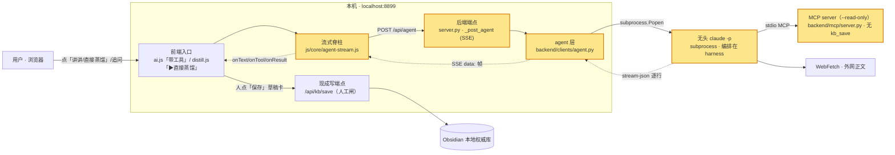
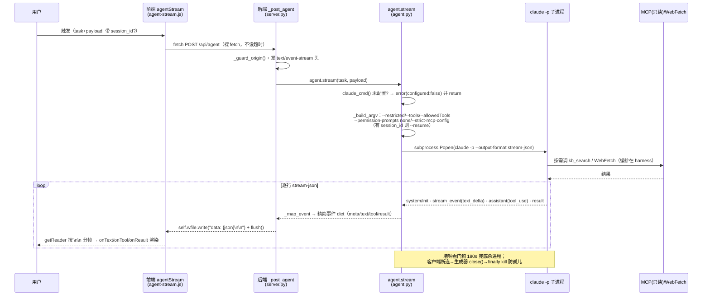
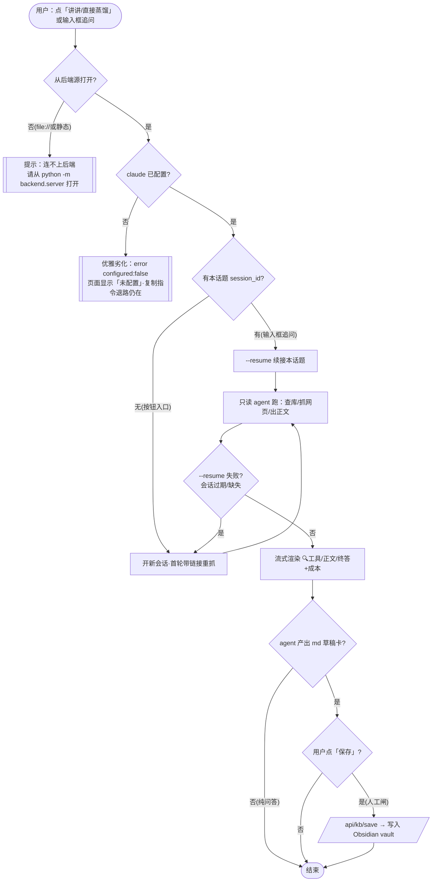

# 图解 · 页面驱动 agent（页面里一键拉起无头 `claude -p`，只读查库/抓网页，流式回显）

> 性质：活文档（功能图解复盘）。**本篇是《功能图解复盘指南》的样板**——三图的标准长相看这里。
> 关联：[`../../adr/0009-page-driven-agent.md`](../../adr/0009-page-driven-agent.md)（决策/理由/代价单一真源）、[`../../adr/0008-mcp-integration-layer.md`](../../adr/0008-mcp-integration-layer.md)（本功能是其 Phase 2 兑现）、主架构图 [`../运行时架构-数据流.md`](../运行时架构-数据流.md)、`.claude/plan/agent-mcp-sidecar.md`（落地记录）。
> 一句话：SPA **不重造 agent loop**，而是后端 `subprocess` 拉起无头 `claude -p`（编排在 harness），把过程 **SSE 流式**送回页面；工具白名单**只读**，写库永远走人工闸。

## 1 · 它是什么 / 缘起

- **背景痛点**：Phase 1（ADR 0008）把知识库能力做成 MCP，但**入口只在终端**——蒸馏靠「复制指令→贴进 Claude Code→跑→贴回来」人肉接力，页面里没有任何驱动 agent 的路子。
- **战果**：页面新增 `POST /api/agent`（流式 SSE）。蒸馏库「▶ 直接蒸馏」、AI 副驾「带工具」对话两个入口，都能在站内一键拉起 agent，实时看到它 `🔍 查库 / 抓网页 / 出正文`，几十秒内产出一张 md 草稿卡。
- **落盘**：[`backend/clients/agent.py`](../../../backend/clients/agent.py)（新模块）、[`backend/server.py`](../../../backend/server.py) `_post_agent`(+dispatch 一行)、[`js/core/agent-stream.js`](../../../js/core/agent-stream.js)（本仓首个流式消费者）、入口 [`js/views/ai.js`](../../../js/views/ai.js) / [`js/views/distill.js`](../../../js/views/distill.js)。**未改 `data.json` 契约、未改现有 `/api/*` 端点**。

## 2 · 架构图（在哪 · 跟谁交互）

主架构图的切片：本功能新增「agent 层」这条支路（`:::new`），挂在既有「前端 ↔ 本机后端」之间；写路径仍回既有 `/api/kb/save → Obsidian`。

**一句话读图**：新增的是 `agent-stream.js`（前端脊柱）+ `_post_agent`（SSE 端点）+ `agent.py`（拉子进程）三个节点；agent **只读**（MCP 以 `--read-only` 拉起，协议层无 `kb_save`）+ WebFetch；**写库不在 agent 手里**，仍是「人点保存 → 既有 `/api/kb/save`」。

## 3 · 实现原理图（内部一步步怎么跑）

有 subprocess + 逐行解析 + SSE 多方来回，用时序图最清楚：

**关键步骤**（点到真实函数）：
1. 前端 [`agentStream()`](../../../js/core/agent-stream.js) 用**裸 `fetch` + `getReader()`**（不用 `net.js` 的 `fetchT`——它带 AbortController 会掐断长连接）。
2. 后端 [`_post_agent`](../../../backend/server.py) 先 `_guard_origin()`，再手写 `text/event-stream` 头、**逐事件 `flush()`**（`ThreadingHTTPServer` 每请求独立线程，天然支持长连接流）。
3. [`agent.stream()`](../../../backend/clients/agent.py) 里 `_build_argv` 叠**纵深只读边界**，`_run_once` 用 `Popen` 拉 `claude -p`，`_map_event` 把 `stream-json` 每行映射成 `meta/text/tool/result`。
4. `session_id` 经 UUID 正则白名单校验后才 `--resume` 续接**本话题**上一轮（原文全文留在服务端会话，追问不重抓）；续接失败降级去掉 `--resume` 重跑=开新会话。

## 4 · 业务流程图（用户/数据怎么走 · 含失败岔路）

**关键岔路**：① 从静态源打开 → 连不上后端提示（与站内其它请求同款）；② claude 未配置 → **优雅劣化**为「未配置」，App 仍零依赖离线可跑；③ 追问走 `--resume` 续接、按钮入口开新话题（**话题隔离**防上下文膨胀/串味）；④ agent **永不自动写库**——只起草，落库必须**人点保存**走既有 `/api/kb/save`。

## 5 · 为什么这么做 · 代价（why 见 ADR 0009，不复述）

- **关键取舍**：选 `subprocess` 拉二进制而非 Agent SDK——正为躲开 `claude-agent-sdk` 这个 Python 依赖，**不砸零依赖北极星**；编排全归 harness，SPA 只当「入口 + 进度视图」。
- **代价 · 门**：App 运行时现在能拉起一个 LLM agent 子进程——一道**能力单向门**（但不引新依赖、不改契约，撤销成本≈0：删端点 + `agent-stream.js` + 两处按钮即回 Phase 1）；每次运行有 API 成本；安全配置对 CLI 版本敏感。
- **决策留证**：三条决策、纵深安全边界的逐层理由、两个「勿简化」的真机坑（`dontAsk` 是「放行」不是「拒绝」；`--tools` 管不住 MCP 暴露的工具，须让 `kb_save` 在只读 server 里**不存在**）——全在 [`ADR 0009`](../../adr/0009-page-driven-agent.md)，此处不重复。

## 6 · 踩坑 / 下一步

- **踩坑（勿「简化」掉）**：`--permission-mode dontAsk` 语义是「别问·直接放行」，单用它 Bash 会真跑 → 靠 `--restricted`+`--tools`+`--permission-prompts none` 才压住；`--allowedTools`/`--tools` 点名管不住 MCP server 暴露的工具 → 必须让 MCP **只读模式不注册** `kb_save`。
- **下一步**：Phase 3 把六维蒸馏 craft（现 `js/core/distill-template.js`）收成 CC skill，页面与 agent 共用同一真源，避免 JS/Python 双份【中·较大门，另记 ADR】；给页面 agent 开任何写/动作能力**必须重审人工闸并另记 ADR**（当前刻意只读）。

## 7 · 变更记录
- 2026-09-10 · v1.0 · 首版。作为《功能图解复盘指南》的样板，把「页面驱动 agent（ADR 0009）」按三图（架构切片 / 时序 / 业务流程）图解，图均对齐真实代码路径。
