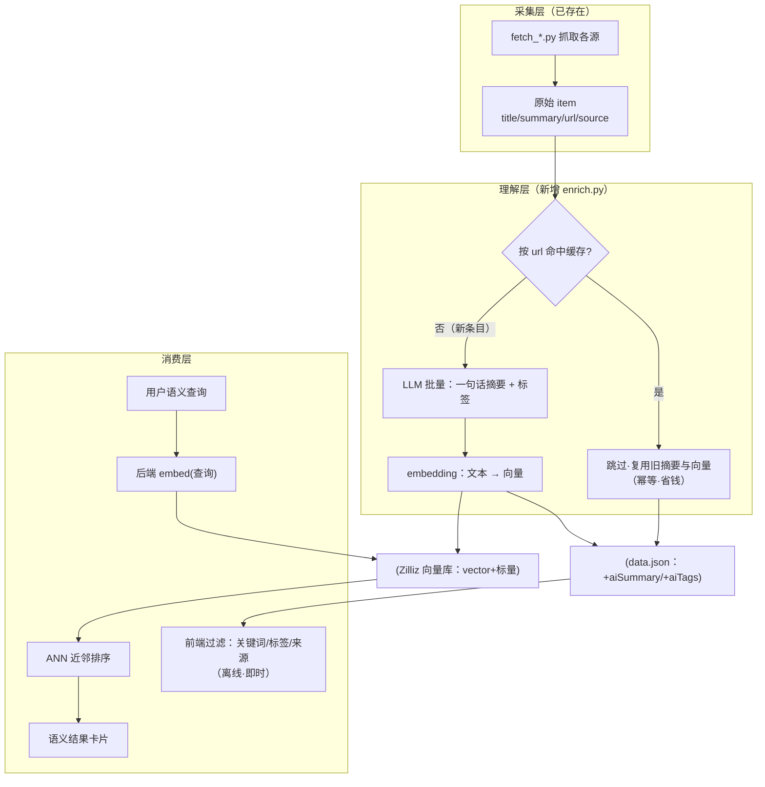
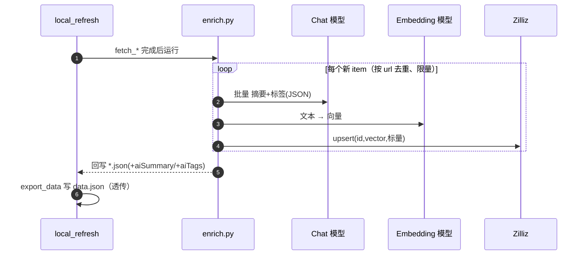
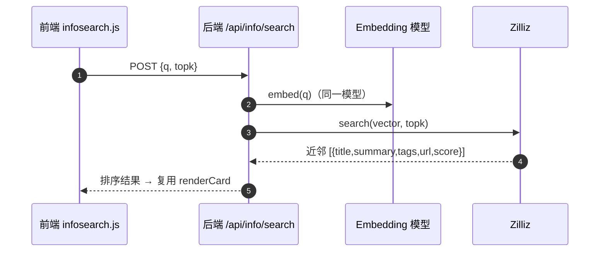

# 资讯语义检索 · 设计

> 决策记录见 [ADR 0011](../adr/0011-zilliz-semantic-search-for-info.md)。本文是实现层设计（第一性原理 + 图 + 契约 + 配置 + 回滚）。

## 1 · 问题与第一性拆解

资讯源增多但每条只有 `{title, summary, url, source}`——无标签、摘要参差（HN 只是"▲分数·评论数"、每日新闻 summary 恒空），必须点原文才知内容；无搜索、无法按兴趣匹配。

把诉求还原为两个**正交**基本需求：

| 需求 | 本质 | 机制 |
|---|---|---|
| 不点进去就知道讲啥 | 信息压缩 | 每条一句话摘要 + 标签（一次算好、按 url 缓存） |
| 快速找到我关心的 | 匹配 | 词面（关键词/标签/来源，离线即时）+ 语义（embedding→最近邻） |

本质：**摘要=压缩、标签=离散索引、向量=连续语义坐标**，三者都是"预先提取信息、换事后低成本检索"。两个不变量：查询与文档必须**同一 embedding 模型**（对称性）；LLM/Zilliz 挂了资讯仍**可降级**（回退原始 summary / 词面筛选）。

## 2 · 三层管线（功能流程图）



## 3 · 时序图

**enrich（点同步时）**——写双存储：



**语义搜索**——token 只在后端：



## 4 · 关键文件

| 层 | 文件 | 职责 |
|---|---|---|
| 配置 | `backend/core/config.py` | `enrich_chat/enrich_embedding/enrich_limits/zilliz` 读取器（缺失即停用） |
| 客户端 | `backend/clients/llm.py` | OpenAI 兼容 chat_json / embed / probe_dim（stdlib urlopen） |
| 客户端 | `backend/clients/zilliz.py` | Zilliz REST v2：has/create_collection、upsert、search |
| 管线 | `backend/pipeline/enrich.py` | 摘要+标签+向量，按 url 缓存幂等、限量、可降级 |
| 管线 | `backend/pipeline/build_zilliz_collection.py` | 探测维度 + 幂等建库（COSINE/AUTOINDEX） |
| 管线 | `backend/pipeline/local_refresh.py` | STEPS 里 export_data 之前插入 enrich |
| 端点 | `backend/server.py` | `POST /api/info/search`：embed(查询)→Zilliz 搜索 |
| 前端 | `js/views/info.js` | 卡片优先 aiSummary、渲染 aiTags；导出 renderCard |
| 前端 | `js/features/infosearch.js` | 叠加式检索面板（词面客户端 + 语义后端） |

## 5 · 契约与配置

- **data.json 契约**：item 增 `aiSummary`(string)、`aiTags`(string[])——单向门（ADR 0011）；前端缺字段回退 `summary`。见 `js/core/net.js` typedef。
- **Zilliz collection `wb_info`**：主键 `id`=sha1(url)（VarChar）、`vector`(FloatVector, 维度探测)、标量 `url/title/summary/tags/source/date`、metric=COSINE、AUTOINDEX、动态字段开。
- **workbench.local.json**（本地、gitignore、勿入库；示例见 `workbench.local.json.example`）：
  ```
  "enrich": { "chat": {baseUrl,model,key}, "embedding": {baseUrl,model,key,dim}, "maxItemsPerRun":200, "batchSize":10 },
  "zilliz": { "endpoint": "https://in03-....cloud.zilliz.com", "token": "...", "collection": "wb_info" }
  ```

## 6 · 回滚（可撤回性）

删 `enrich` STEPS 一行 + 删 `enrich.py`/`llm.py`/`zilliz.py`/`build_zilliz_collection.py`/`/api/info/search` + 前端搜索条 → 回纯抓取管线；`aiSummary`/`aiTags` 前端有兜底，删了不崩。去掉 `workbench.local.json` 的 `enrich`/`zilliz` 段即停用（enrich 跳过、语义搜索隐藏）。

## 7 · 验证

见 [ADR 0011] 及实施计划；端到端：`build_zilliz_collection` 建库 → `enrich` 单跑（各源出 aiSummary/aiTags、二次跑命中缓存 LLM 调用≈0）→ 点「同步数据」全链路 → chrome-devtools 走查（卡片摘要+标签、词面筛选、`/api/info/search` 200、无 console 报错）。收尾按 `docs/guides/功能图解复盘-指南.md` 出三图复盘。
