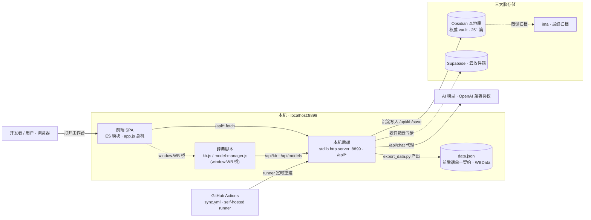

# DailyWorkbench 运行时架构 · 数据流

> 性质：**活文档 · 架构总图**。一页看清「前端 ↔ 本机后端 ↔ data.json 契约 ↔ 三大脑存储 + 外部」怎么连、数据怎么流。
> 图用 mermaid 内联（GitHub / Claude Artifacts 原生渲染，可直接编辑，零构建）——符合北极星「零构建·零依赖」。
> 关联：[`../TECH_CHARTER.md`](../TECH_CHARTER.md)（工程红线）、[`../principles/开发心法-多维思维总纲.md`](../principles/开发心法-多维思维总纲.md)、[`../planning/知识飞轮-路线图.md`](../planning/知识飞轮-路线图.md)。

---

## 总图

---

## 读图（节点 → 真实文件）

| 区 | 节点 | 是什么 | 真实文件 |
|---|---|---|---|
| 前端 | **前端 SPA** | ES 模块视图层，`app.js` 是路由/接线总机；状态单一真源 | [`js/app.js`](../../js/app.js)、[`js/core/state.js`](../../js/core/state.js) |
| 前端 | **经典脚本** | 非 ES 模块的 kb / 模型管理，经 `window.WB` 桥接线 | [`js/kb.js`](../../js/kb.js)、[`js/model-manager.js`](../../js/model-manager.js) |
| 契约 | **data.json** | 前后端**唯一契约**，类型只在一处 `@typedef WBData` | [`data.json`](../../data.json)、[`js/core/net.js`](../../js/core/net.js) |
| 后端 | **本机后端** | Python **stdlib** `http.server` + 路由表，跑 `/api/*` | [`backend/server.py`](../../backend/server.py) |
| 存储 | **三大脑** | Obsidian 本地权威 / Supabase 云收件箱 / ima 最终归档 | — |
| 外部 | **AI 模型 / GitHub Actions** | 模型经 `/api/chat` 后端代理；定时同步经 self-hosted runner | [`.github/workflows/sync.yml`](../../.github/workflows/sync.yml) |

## 三条关键链路

1. **捕获 → 沉淀**：前端调 `/api/kb/save` → 后端把经验卡写入 **Obsidian 本地权威库**（飞轮的「沉淀」环）。
2. **AI 对话**：AI 助手 → 后端 `/api/chat` **代理转发**到模型——**API key 只在本机、不落前端**（安全红线）。
3. **自动同步**：**GitHub Actions + self-hosted runner** 定时触发后端重建 `data.json`，前端消费（`export_data.py` 产出 → 前端读契约）。

## 一句话设计取舍

零构建前端（ES 模块 + `window.WB` 桥）× stdlib 后端 × `data.json` 单一契约 × 三大脑存储——每一处「为什么这么选、何时该重估」见 [`TECH_CHARTER`](../TECH_CHARTER.md)；「一个功能/改动该戴哪顶帽子」见 [`开发心法总纲`](../principles/开发心法-多维思维总纲.md)。

---

## 附：图怎么维护 / 更精致版

- **改这张图**：直接编辑上面的 mermaid 源即可（GitHub/Artifacts 原生渲染）。要导出 png/svg 或自包含 HTML，用 `diagram-render` skill（mermaid/d2 皆可，离线中文安全）。
- **精致交互版**：用 `archify` skill 生成的**交互式 HTML** → [`../reference/devhtml/运行时架构-交互版.html`](../reference/devhtml/运行时架构-交互版.html)（类型配色 + 4 个引导视图逐链路追溯 + 节点锚定 git 源文件的证据链 + 主题切换/导出）。适合演示/深读，用浏览器打开。**日常维护以本页 mermaid 为准**——交互版要更新需重跑 archify（改 IR + 迭代调几何），成本较高，非高频不动。

## 变更记录
- 2026-09-02 · v1.0 · 初版。缘起：评估 archify skill 时对本项目做架构图 bake-off（archify vs diagram-render），顺带补上项目缺失的一张运行时架构总图；采 mermaid 内联为可维护主版本。
