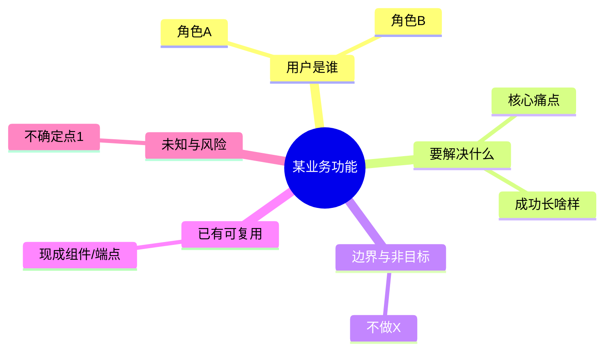
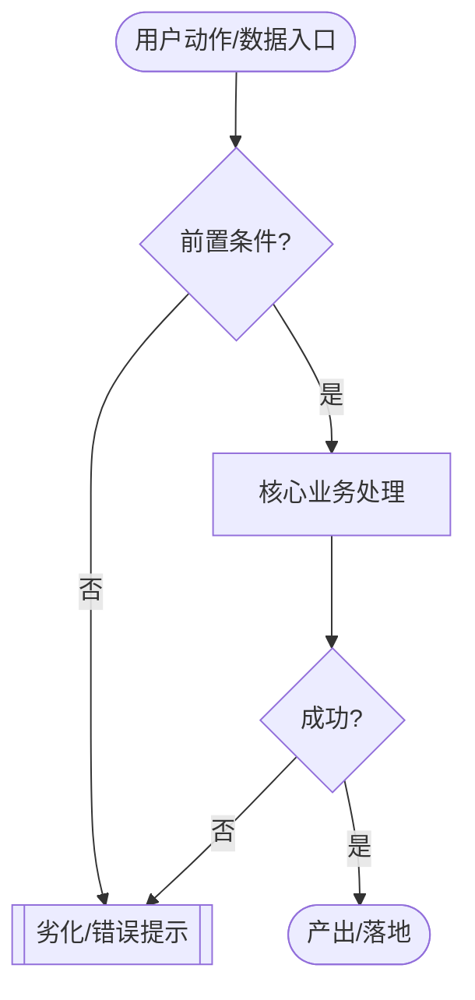
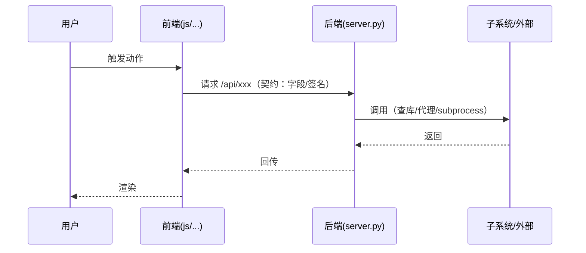
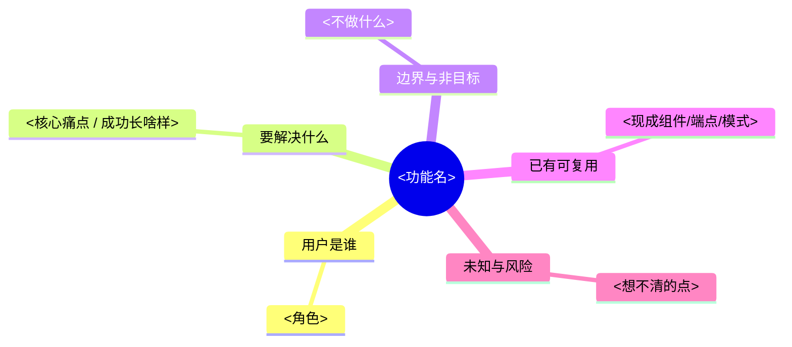
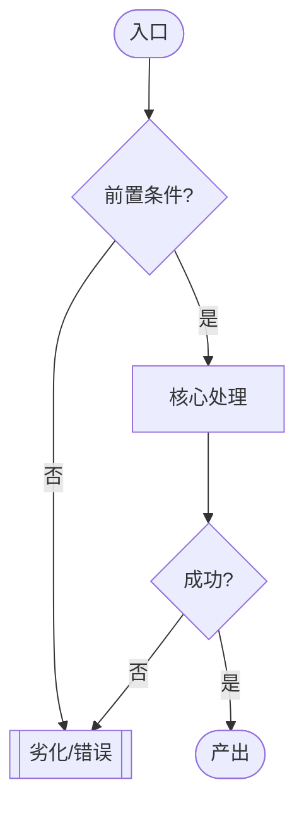
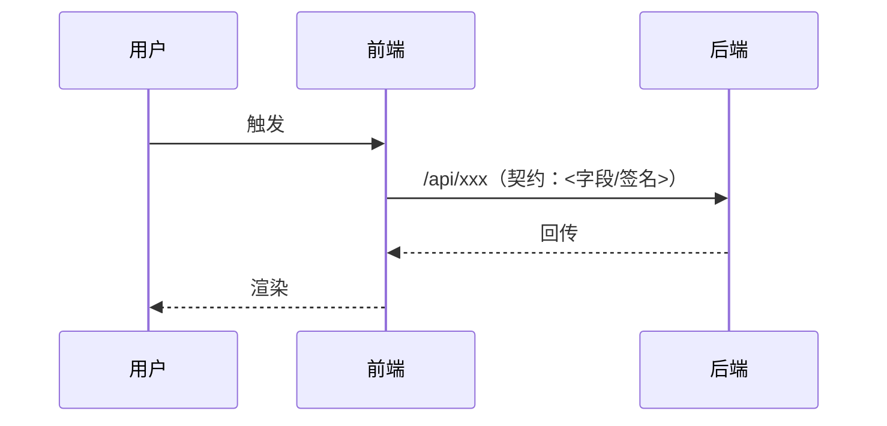

# 业务功能开工准则 · 图先行（先思维导图捋业务 → 再流程图/时序图定实现思路 → 才写码）

> 性质：**操作指南（how-to）· 开工准则**。教「动手写一个业务功能前，怎么用几张图把业务和实现思路捋清，再写码」。
> 心法上位：[`../principles/开发心法-多维思维总纲.md`](../principles/开发心法-多维思维总纲.md) §2「排队戴帽」——本准则是其时序里 **「验证 → 设计」之间那一步**（先捋业务、再定实现思路，别在想法阶段跳到工程帽）。
> 收尾对接：[`功能图解复盘-指南.md`](功能图解复盘-指南.md)——**开工画草图定思路 → 写码 → 收尾画定稿图对齐代码**，一前一后闭环。
> 一句话：**每张图只回答一个问题**——思维导图答「业务是什么」、业务流程图答「用户/数据怎么走」、时序图答「多方怎么按时序交互」；**按不确定性分档、软自检过目、图可抛**，别把它做成瀑布。

---

## 0 · 它符合软件工程思想吗（为什么立这条准则）

**符合**：先思维导图（问题域）后流程/时序（解决域）= 「先搞懂要解决什么，再设计怎么解决」，这是领域建模（DDD/事件风暴）、UML 活动图·时序图、C4 动态视图的常识；「设计先于编码、在最便宜的阶段迭代」也是本仓界面准则 §6.0 已实证的（在图上改比在代码上改便宜一个数量级）。

**但要防两条退化**（否则就成了坏软工）：
1. **防瀑布/过度设计**——「大爆炸式前期设计」被敏捷否定，宪章也守 YAGNI（[`../TECH_CHARTER.md`](../TECH_CHARTER.md) 引入 X 四问 Q1「现在真需要吗」、L67「复杂/不可逆先出 plan，trivial 直接做，**不为流程而流程**」）。→ 故**按不确定性分档**（§2），不是每个改动都三张图。
2. **防图腐烂/分析瘫痪**——开工图是**一次性思考脚手架**，为「尽快、正确地动手」服务，不是拖延，也不必都长期维护。

> 结论：图先行是对的经典软工姿势，但必须套「分档触发 + 软门 + 图可抛」三道闸——正是本仓 §6.0 三类触发、心法 §4 四档、宪章「不为流程而流程」的现成护栏。

---

## 1 · 什么时候用（按不确定性分档）

**判据**：不确定性/风险越高、越不可逆，越值得先画图。沿用心法 §4「默认低档起步、被真实使用拉着升档」与界面准则 §6.0「三类触发才动仪式」。

| 档 | 什么样的功能 | 画什么 |
|---|---|---|
| **全套三图** | 新业务概念 / 新链路（新 `/api` 端点·新数据流）/ 改 `data.json` 契约或其它单向门 / 业务规则复杂或想不清 | 思维导图 + 业务流程图 + 时序图 |
| **减档** | 中等复杂、思路基本清但要对齐 | 只思维导图，**或**只一张业务流程图 |
| **免图** | 沿用现成模式的小改、纯技术重构、修 bug、纯字段增删 | 不画，直接写 + `CHANGELOG.md` 一句思路 |

> 和界面准则 §6.0 是**姊妹条**：§6.0 管「长什么样」的视觉门禁（新视觉/组件/骨架才出 HTML 效果图），本准则管「业务与实现思路」的开工门禁。两者独立触发，可能都触发、也可能只触发一个。

---

## 2 · 三步工序（每步戴一顶帽子）

对应心法 §2 时序：**验证 →〔本准则〕→ 设计 → 实现**。

### 步骤一 · 思维导图捋业务（产品帽 / 验证阶段）

**回答「业务是什么」**。用 `mermaid mindmap` 把这团业务摊开，捋清五件事：**用户是谁 / 要解决什么（成功长啥样）/ 边界与非目标 / 已有可复用 / 未知与风险**。



**软自检**：业务捋清了吗？「要解决什么」能一句话说清吗？有没有其实**不该做**（YAGNI，问一句「这周用几次·为谁」，答不上来直接砍）？

### 步骤二 · 业务流程图 + 时序图，定实现思路（设计/工程帽）

**业务流程图**（`flowchart TD`）回答「用户/数据怎么走」——从入口走到产出，**必须带失败岔路**（前置不满足、劣化、错误分支）：



**时序图**（`sequenceDiagram`，有多方来回/异步/subprocess 时才画）回答「谁按什么顺序调谁」：



**这一步同时先定「契约缝」**（接口先于实现，贴本仓单一契约红线）：本功能要不要给 `data.json` 加字段？新 `/api/*` 端点的入参/出参签名是什么？——契约定了，前后端才能各写各的。改 `data.json` 契约是**单向门**，先在图/文字里定清再动。

**软自检**：实现思路走通了吗？失败岔路想过了吗？契约（`data.json` 字段 / `/api` 签名）定了吗？

### 步骤三 · 才写码（工程帽）

YAGNI + 双向门先试 + 模块边界（一文件一句话说清）。图到这里已把不确定性压掉大半，写码是「把想清的事翻译成代码」，不再边写边想业务。

---

## 3 · 写码前 · 软自检清单（自己过目，不上 CI）

单人项目，这是**软门**——对照勾一遍即可，不做 CI 硬门（避免仪式压死人，宪章 L67）。

- [ ] **分档判过了**：这个功能到底该走全套 / 减档 / 免图？（§1）
- [ ] **业务捋清**：用户是谁、要解决什么、边界、可复用、风险——思维导图上都有？
- [ ] **该不该做**：过了「引入 X 四问」——现在真需要吗？违背北极星吗？单向门吗？（`TECH_CHARTER`）
- [ ] **实现思路**：业务流程含失败岔路？多方交互画了时序？
- [ ] **契约先定**：`data.json` 字段 / `/api` 签名定清了？改契约=单向门，想清了吗？
- [ ] **复用优先**：能复用现成组件/端点/模式就别新造（心法设计帽）。

> 全是「免图」档的小改，跳过本清单，直接写 + CHANGELOG。

---

## 4 · 图可抛 + 与收尾复盘的闭环

- **开工图允许粗**：它是**一次性思考脚手架**，用于把业务和思路捋清就够了，**不追求对齐最终代码**，也不必都长期维护。目的是「尽快、正确地动手」，不是画得漂亮。
- **写完核对是否走样**：实现完，回看开工画的业务流程/时序图——真实代码走的是不是这条路？走样了说明当初没想清，正好是复盘素材。
- **沉淀成收尾定稿图**：把核对过、对齐真实代码路径的图，按 [`功能图解复盘-指南.md`](功能图解复盘-指南.md) 沉淀成该功能的三张定稿图（架构/实现原理/业务流程）。**于是开工草图不是抛弃物，是收尾定稿图的草稿。**

> **开工图 ≠ 收尾图**：开工图**求快求清**（草、允许错、帮你想）；收尾图**求准对齐代码**（图对不上真实代码路径比不画更糟，见复盘指南铁律）。别拿开工的标准要求收尾，也别拿收尾的标准卡住开工。

---

## 5 · 与其它文档分工（别重复、别打架）

| 文档 | 管什么 | 与本准则的关系 |
|---|---|---|
| [`开发心法-多维思维总纲`](../principles/开发心法-多维思维总纲.md) | 元层：一个功能何时戴哪顶帽子 | **上位**；本准则是其 §2 时序「验证→设计」间的具体工序 |
| [`TECH_CHARTER`](../TECH_CHARTER.md) | 工程红线：零依赖/YAGNI/单向门/引入X四问 | 提供本准则的**防瀑布护栏**与「该不该做」判据 |
| [`界面设计准则`](../design/界面设计准则.md) §6.0 | 视觉门禁：新视觉/组件/骨架先出 HTML 效果图 | **姊妹门禁**（管「长什么样」）；本准则管「业务与实现思路」 |
| [`功能图解复盘-指南`](功能图解复盘-指南.md) | 收尾：对齐代码的定稿三图 | **闭环下游**；开工草图→收尾定稿图 |
| 仓根 `CHANGELOG.md` | 做了什么 + 一句思路 | 免图档的小改只走这里 |
| `docs/adr/*` | 单向门决策留证 | 改契约/不可逆决策在此留证，不在开工图里重复 |

---

## 6 · 模板骨架（复制即用）

复制到你的开工草稿（临时文件或 `.claude/plan/` 里），按分档删掉用不上的图（外围 `~~~` 只为让里面的 ` ``` ` 正常显示，用时删掉这层 `~~~`）。

~~~markdown
# 开工草图 · <功能名>（求快求清，允许粗）

## 一、思维导图捋业务（业务是什么）


## 二、业务流程图（用户/数据怎么走 · 带失败岔路）


## 三、时序图（多方怎么按时序交互 · 无多方来回可省）


## 四、契约先定（接口先于实现）
- data.json 新字段：<有/无，字段名与类型>
- /api 端点签名：<入参 / 出参>
- 是否单向门（改契约）：<是→写 ADR / 否>

## 五、写码前软自检
- 分档：<全套/减档/免图>  · 业务捋清：<Y/N>  · 该不该做（四问）：<Y/N>
- 失败岔路想过：<Y/N>  · 契约定清：<Y/N>  · 复用优先：<Y/N>
~~~

---

## 7 · 变更记录
- 2026-09-10 · v1.0 · 首版。缘起：本仓无「功能开工流程」文档，规则散在心法/§6.0/CLAUDE.md；把「业务功能开工·图先行」立成分档 + 软自检 + 图可抛的准则，接进心法 §2 时序与 CLAUDE.md 开工先读，并与收尾侧《功能图解复盘-指南》闭环。三个 mermaid 起手式（mindmap/flowchart/sequenceDiagram）已 `mermaid_preview` 验证可渲染。
