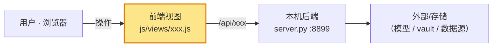
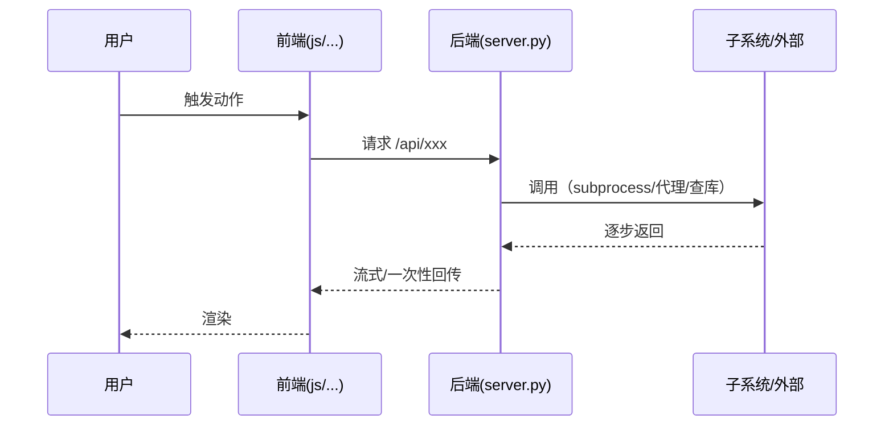
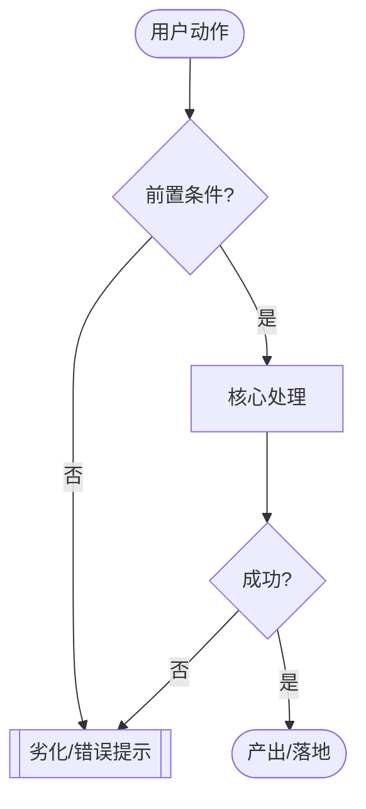

# 功能图解复盘 · 指南（每个功能模块「一图三看」怎么写）

> 性质：**操作指南（how-to）**。教「开发完一个功能模块，怎么快速产出一篇带三张图的图解复盘」。
> 归位真源：[`../README.md`](../README.md)（§2 词表已给 `图解-<模块>` 路由）。心法上位：[`../principles/开发心法-多维思维总纲.md`](../principles/开发心法-多维思维总纲.md)——图解复盘=**决策帽**收尾动作，别在写代码时顺手画（那是设计帽/工程帽的活）。
> 一句话：**每张图只回答一个具体问题**——架构图答「在哪」、实现原理图答「怎么跑」、业务流程图答「用户/数据怎么走」；能一句话说清就不画，why 用文字，结构和流程才用图。

---

## 1 · 什么时候写（别每个 commit 都写）

| 改动性质 | 要不要成篇图解复盘 | 走哪 |
|---|---|---|
| 新功能模块 / 新组件类 / 新链路（新端点、新数据流、新交互骨架） | **写**（三图齐） | 本指南 → `docs/design/功能图解/图解-<模块>.md` |
| 沿用现成类的小改、纯字段增删、无新链路 | **不写**，一句思路进 `CHANGELOG.md` | 仓根 `CHANGELOG.md`（Keep a Changelog） |
| 里程碑 / Phase 级收尾（跨多个功能的复盘） | 走**里程碑复盘**（更重，可含 devhtml/archify 交互图） | `docs/planning/复盘-*.md` |

> 判据同界面准则 §6.0 的「新视觉/新组件/新骨架才触发」精神——**仪式别淹死一人项目**。拿不准就先只写 CHANGELOG，等这块真复杂了再补图解。

---

## 2 · 三张图规格（含 mermaid 起手式）

三张图**一律内联 mermaid**（跟代码同仓、diff 可见、改动零成本；GitHub/Claude Artifacts 原生渲染）。**不为单功能生成 devhtml/archify 交互图**——那是里程碑级/演示分享才升的档（见 [`../research/开发阶段-Skill选型账本.md`](../research/开发阶段-Skill选型账本.md) §6）。

### 图一 · 架构图 —— 答「这个模块在系统里的位置、跟谁交互」

**画法铁律：从主架构图切片，不重画全系统。** 以 [`../design/运行时架构-数据流.md`](../design/运行时架构-数据流.md) 的总图为底，**只画本功能触及的节点 + 新增的边**，新增节点用 `:::new` 高亮。



### 图二 · 实现原理图 —— 答「点了之后内部一步步怎么跑通」

有**时序/多方来回**（SSE、轮询、subprocess、前后端多次交互）→ 用 `sequenceDiagram`；纯内部步骤/分支 → 用 `flowchart TD`。



### 图三 · 业务流程图 —— 答「用户/数据在这个功能里怎么走（含失败岔路）」

`flowchart TD`：从用户动作/数据入口出发走到产出，**必须带分支与失败路径**（真实岔路才有价值，例如「必须从后端源打开否则 Failed to fetch」「未配置 → 优雅劣化提示」）。



> CJK 标签用 `<br/>` 换行、避免特殊符号进节点文本（emoji 在部分字体渲染成豆腐，见 OpenCLI 复盘踩坑）。

---

## 3 · 归位与命名

- **放这里**：`docs/design/功能图解/图解-<模块名>.md`（后缀 `图解-` → design/功能图解，见 README §2）。
- **命名**：`<模块名>` 用中文或 kebab（如 `图解-页面驱动agent.md`）。**单文件随代码演进、不带 vX**；只有需要历史对照时才另存。
- **落位后**：回 [`../README.md`](../README.md) §4 索引登记一行。（新建时可让 `doc-filing` skill 自动套规范。）

---

## 4 · 整篇模板骨架（复制即用）

复制下面到新文件，把 `<>` 填掉、三张图换成真图即可（外围 `~~~` 只是为了让里面的 ` ``` ` 正常显示，粘进新文件后删掉这层 `~~~`）。结构沿用模板级先例 [`../planning/复盘-OpenCLI取数层接入.md`](../planning/复盘-OpenCLI取数层接入.md)。

~~~markdown
# 图解 · <模块名>（一句话它是什么）

> 性质：活文档（功能图解复盘）。
> 关联：<相关 ADR / CHANGELOG 批次 / .claude/plan / 主架构图>
> 一句话：<这个模块解决什么、怎么一句话概括它的做法>

## 1 · 它是什么 / 缘起
- 背景痛点：<为什么要这个功能>
- 战果：<做出了什么、端到端能干嘛>
- 落盘：<新增/改动的关键文件，列路径>

## 2 · 架构图（在哪 · 跟谁交互）
```mermaid
<图一：主架构图切片 + :::new 高亮>
```
一句话读图：<本功能新增了哪个节点、接到哪条既有链路>

## 3 · 实现原理图（内部怎么跑）
```mermaid
<图二：sequenceDiagram 或 flowchart TD>
```
关键步骤：<按图里编号，一步一句，点到真实文件/函数>

## 4 · 业务流程图（用户/数据怎么走）
```mermaid
<图三：flowchart TD，带失败岔路>
```
关键岔路：<成功路径 + 每条失败/劣化分支各一句>

## 5 · 为什么这么做 · 代价（why，别复述 CHANGELOG）
- 关键取舍：<选了什么、放弃了什么、为什么>
- 代价 · 门：<承担了什么成本，是双向门还是单向门>
- 决策留证：链到对应 <ADR / TECH_CHARTER 红线>，不在此重复

## 6 · 踩坑 / 下一步
- 踩了什么：<真机排出的坑，尤其「勿简化」的那种>
- 下一步：<待优化项，标【代价·门】>
~~~

---

## 5 · 与其它记录层的分工（别重复、别打架）

| 层 | 管什么 | 放哪 |
|---|---|---|
| **本类（功能图解）** | 单功能：**在哪 / 怎么跑 / 怎么走**（三图 + why 摘要） | `docs/design/功能图解/图解-*.md` |
| CHANGELOG | 版本变更：做了什么（简）+ 一句思路 + 链接 | 仓根 `CHANGELOG.md` |
| ADR | 单向门决策：决策/理由/代价/何时重估 | `docs/adr/NNNN-*.md` |
| 实施计划 | 过程性：接下来改哪些文件 | `.claude/plan/*.md` |
| 里程碑复盘 | 跨功能：这一程的心智模型 | `docs/planning/复盘-*.md` |

> 铁律：**why 链到 ADR，不复述**；图解只负责把「结构和流程」讲清楚。三图对不上真实代码路径的图解，比不画更糟——图与代码脱节是最坏的失败模式。

## 6 · 变更记录
- 2026-09-10 · v1.0 · 首版。缘起：把「每功能一篇带三图复盘」的实践固化成可复用指南 + 模板骨架，配 `docs/design/功能图解/` 归位。样板见 [图解-页面驱动agent.md](../design/功能图解/图解-页面驱动agent.md)。
