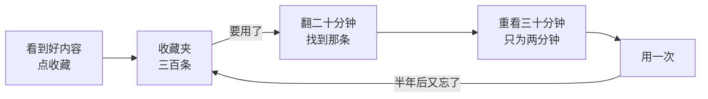
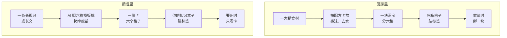
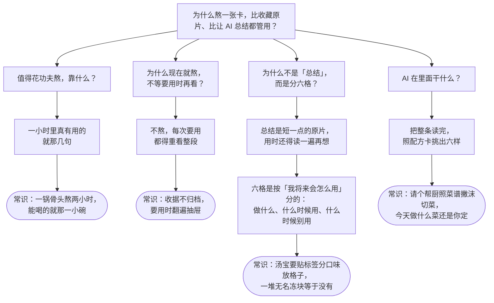
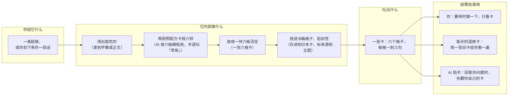

# 内容蒸馏，讲给收藏夹里有三百条视频的你

读完这份东西，你应该能做到三件事：
用自己的话把「蒸馏」讲给家里人听；
说出「汤宝」这个比喻哪里对不上；
看到一条内容，判断它该不该蒸馏。

> 本文的「蒸馏」＝**内容蒸馏**：把一条长视频或长文，提炼成一张能直接照着用的卡。新闻里「DeepSeek 蒸馏别家模型」的「蒸馏」是另一回事，第二问末尾和第七问有对照。
> 文中的「工作台」，指我们自己做的一个电脑小程序，专门存这些卡。不用它也能看懂这份东西。
> 配套图解：`内容蒸馏-小白图解-2026-09-24.html`（同目录，图已渲染好，浏览器直接开）。

术语第一次出现，括号里当场解释。能用「汤宝」「配方卡」「格子」说清的，就不用术语。

---

## 一、没有它的时候，人是怎么受苦的

你的收藏夹里有三百多条视频。

上个月，你看到一个 up 主（在视频网站上发视频的人）讲「厨房收纳的五个办法」。三十分钟，讲得真好。你点了收藏。
今天你要收拾厨房。你记得他讲过一个「抽屉分层」的招。
你打开收藏夹。三百条，标题都差不多。翻了二十分钟，找到了。
点开，三十分钟。你要的那一招在第 18 分钟，讲了两分钟。前面 17 分钟是他的故事、广告，和你早就知道的事。
你照着做了。半年后搬家，又要收拾厨房。你又忘了。再来一遍。

疼在三处：
- 有用的话就那两分钟，包在三十分钟里。
- 每次要用，都得把三十分钟重看一遍。
- 看完没留下东西，下次从头再来。

以前怎么解？两条路。

- 路一：边看边做笔记。管用，但一条三十分钟的视频做笔记要四十分钟。你有三百条。
- 路二：让 AI（会读会写的电脑程序，你手机里的智能助手就是一种）「总结一下」。快，出来一段三百字。可你要用的时候，还是得把这三百字读一遍，再自己想「那我该怎么做」。它只是短一点的原片。

两条路都不解渴。

---

## 二、一句话说它是什么 + 一个主比喻

一句话：**内容蒸馏，就是把一条一小时的视频或长文，熬成一张能直接照着用的卡片。以后只看卡，不看原片。**

主比喻：**把一大锅高汤熬成汤宝。**

你熬过汤。一大锅骨头、菜、水，小火熬两小时。撇掉浮沫，倒掉多余的水。最后剩一小碗浓的。倒进格子里冻起来，就是汤宝。
下次做菜，不用再熬两小时。掰一块丢进锅里。

为什么叫「蒸馏」？这个词借的是酿酒：一大锅粮食加热，精华跑出来，渣留锅底。和熬汤宝是一回事。下面全用汤宝讲。这回答了你懵的第②点：不是化学课，就是「把精华逼出来」的意思。

对照表（以后全篇都用左边这一套词）：

| 厨房那边 | 蒸馏这边 |
|---|---|
| 一大锅食材 | 原视频或长文（视频的话要先拿到字幕：视频里的话转成的文字） |
| 配方卡：这锅要留什么 | 六格模板：卡上要填的六个格子（工作台里把这六个格子叫「六维」，一个格子算一维，同一回事） |
| 熬、撇沫、去水 | AI 把全文读完，挑出六样，扔掉废话 |
| 帮厨 | AI |
| 一块汤宝，分六格 | 一张卡，六个格子。下面叫「六格卡」 |
| 冰箱格子，贴标签 | 知识本子：一个能搜、卡和卡能互相链接的记事软件（比如 Obsidian），带标签 |
| 做菜时掰一块 | 要用时只看卡；每天还会挑一张旧卡给你温一遍 |

### 顺手说清你懵的第③点：新闻里的「蒸馏」是另一回事

新闻里「DeepSeek（一家做 AI 的公司）蒸馏了别家的模型」，那叫**模型蒸馏**：让一个小的 AI 反复看大的 AI 怎么答题，学它的分寸。教出来的是 AI。
这里的内容蒸馏，教的是**你**。锅里熬的是视频，喝汤的是人。
两件事只是共用了一个词。第七问的表里有一行对照。

---

## 三、第一性原理：它到底靠什么起作用

「第一性原理」的意思：一路问「这靠什么」，问到你本来就知道的事为止，再从那件事往上搭回来。下面就这么干。

### 往下问，问到你本来就知道的事为止

下面这张图：最上面一个大问题，往下分四条线各问到底。每条线最后落到一件你早就知道的事，画成圆角框。

四条线都问到了你本来就知道的事。到这儿不往下问了。

### 从常识往上搭回来

1. **先拿「能喝的就那一小碗」。** 一小时内容里，真能改变你做法的就几句。其余是故事、广告、重复。只留那几句。这一步决定了「值得熬」。
2. **再加「收据要归档」。** 看完当场熬好、存起来，只花一次功夫。以后每次用都不必重看。用得越多，这一次功夫越划算。这一步决定了「现在就熬」。
3. **再加「汤宝要分格贴标签」。** 不是缩短，是分格：这条内容最想说的一句话是什么、怎么做、什么情况下用、什么情况下别用、我明天就能做的一件事、它从哪来。六个格子，每格回答你将来会问的一个问题。这一步让「总结」变成「卡」。这回答了你懵的第①点：总结是短原片，卡是按用途分好的格子。
4. **再加「帮厨照菜谱干活」。** 读一小时、挑六样，人做要四十分钟。AI 几十秒。你只管定配方卡，它照着挑。这一步让三百条都熬得起。
5. **最后定一条验收。** 卡熬好了没有，不看它写得漂亮不漂亮，看一件事：**以后你还用不用回看原片。** 回看了，这张卡就算失败，重熬。

五块常识拼起来，就是内容蒸馏。没有一块是新发明。新的是「让 AI 照配方做，并且用『不回看』当验收」。

### 哪些条件成熟了，它才可能出现

- AI 能一口气读完一小时的字幕或一篇长文，并按要求挑东西。这是近几年才做得到的事。具体从哪一年开始，我不确定。
- 字幕和正文拿得下来：视频网站多数有字幕；网页能转成纯文字；实在拿不到的，你在手机上划一段话复制出来，也算。
- 有个能搜、卡和卡之间能互相链接的本子。手写本翻不动三百张卡，电子本一搜就到。

### 最反直觉的一个设计决定

验收不看「总结得准不准」，看「以后还回不回看原片」。
准不准是 AI 的事。回不回看是你的事。只有后者说明这张卡真顶用。

这条规矩带来一个后果：**大部分内容熬完发现没货。** 一小时视频，六个格子填不满两个。那就扔。
蒸馏首先是筛，不是存。第七问的误区表里还会讲。

---

## 四、原理图

图上的动作，按顺序：

1. 你刷到一条好内容，把链接丢进「收件箱」（一个先存着、以后再处理的篓子）。手机上划一段话复制过去也行。
2. 拿到字幕或正文。拿不到的，就用你划的那段。
3. AI 照六格模板读一遍，每格挑出对应的话。填不满的格子留空，不编。
4. 六个格子装成一张卡，写上来源、日期、主题。
5. 卡存进知识本子。收件箱里那条标上「已蒸馏」。
6. 以后：要用时搜卡；每天有一张旧卡自动浮上来给你温一遍；问 AI 助手问题时，它先翻你的卡。

六个格子分别装什么：

| 格子 | 用做菜的话说 | 装的是 |
|---|---|---|
| 核心观点 | 这锅汤到底是什么味 | 这条内容最想说的一句话 |
| 方法步骤 | 怎么做 | 照着能做的几步，每步一个动作 |
| 适用场景 | 哪几道菜能放 | 什么情况下这招管用 |
| 边界反例 | 哪几道菜千万别放 | 什么情况下这招失效、会坏事 |
| 可复用动作 | 明天就能下锅的那一块 | 你明天就能做的一件具体的事 |
| 出处 | 从哪锅熬的、第几分钟 | 链接、作者、日期，关键的话在第几分几秒 |

---

## 五、比喻在哪里失效

这一问用表格代替图。

| 你可能顺着「汤宝」以为…… | 其实…… |
|---|---|
| 汤宝熬掉了香气没关系，浓的就是好的。 | 卡熬掉的，可能正是要紧的：例子、语气、现场感。一段讲「怎么和孩子好好说话」的视频，熬成六格后，最打动你的那个场景没了。所以有些内容本来就不该熬，第七问讲。这是比喻最对不上的地方。 |
| 帮厨不会凭空造出锅里没有的味。 | **AI 会。** 它可能写出原片里没说过的话，说得还很像。所以「出处」那一格不能省：链接、第几分几秒，让你能回锅核对。卡上任何一句你觉得不对，先去出处查。 |

还有一处对不上，放到第七问的误区表里讲：汤宝人人通用，卡不是。配方卡是按你要解决什么问题定的。

---

## 六、它已经在你生活里了

这一问用列表代替图。

你早就在做的三件事，就是蒸馏：

1. **妈妈的菜谱本。** 电视里教一道菜讲二十分钟，她抄下来就七行：材料、步骤、火候、哪里容易糊。以后做菜看本子，不重看节目。六格卡就是这个本子多了三格：什么时候用、什么时候别用、明天做哪一件。
2. **学生的错题本。** 不抄课本，只抄「我在哪一步错、下次怎么避」。这就是「边界反例」和「可复用动作」两个格子。
3. **读书划线和读书笔记。** 划线是收藏夹：留了痕，回头还得重读。笔记才是卡：合上书也能讲出来。

你会在这些地方撞上「蒸馏」这个词：

- 工作台里有一个「蒸馏库」，放的就是这些卡。
- 收件箱每条内容旁边有个「→ 蒸馏」按钮。
- 每天首页浮出来一张「今日温故」卡，就是从蒸馏库里挑的。

---

## 七、什么时候不该用 / 常见误区

这一问用表格代替图。

### 什么时候别熬

| 情况 | 该不该熬 | 为什么 |
|---|---|---|
| 小说、音乐、旅行 vlog、一段让你哭的演讲 | 别熬 | 你要的是过程和感受，熬完就没了。收藏原片，想看再看。 |
| 本来就短的：一条两百字的帖子、一张图 | 别熬，直接存原文 | 原文比卡还短，熬是白费功夫。 |
| 你三个月内用不上的领域 | 先别熬 | 熬也是成本。先问「三个月内会用吗」，会再熬。 |
| 需要一字不差的：合同、法条、药品说明、代码 | 别熬，存原文，加一句自己的标注 | 熬就是改写，改写会失真。这类东西差一个字就出事。 |
| 一条内容你看完发现只有一句有用 | 熬，但只填一两格 | 六格填不满不是失败。硬填才是编。 |

### 常见误区

| 误区 | 实情 |
|---|---|
| 「蒸馏就是让 AI 总结一下。」 | 总结是短一点的原片，用时还得读一遍再想。蒸馏是按「你将来会怎么用」分好六格，验收是以后不回看原片。第三问那张图。 |
| 「熬得越多越好。」 | 汤宝囤满冰箱一块不用，等于收藏夹换了个地方。只熬会用的。第三问讲过：蒸馏首先是筛。 |
| 「AI 熬出来的就是对的。」 | 它会写出原片没说的话。看到觉得不对的，先去「出处」那格查。第五问第二行。 |
| 「新闻里 DeepSeek 蒸馏别家模型，就是这个。」 | 那是**模型蒸馏**：小的 AI 学大的 AI 怎么答题，教的是 AI，学生是一台电脑。这里是**内容蒸馏**：熬的是视频，喝汤的是你。同一个词，两件事。 |
| 「一份配方卡，全世界通用。」 | 汤宝人人一个味，卡不是。六个格子是按「你会怎么用」定的。同一条视频，开店的人和带孩子的人，熬出来的卡不一样。 |
| 「熬完存好就完了。」 | 不掰下来用，等于白熬。搜到用、温故卡看到用、AI 助手引用到，才算回本。 |

---

## 掌握验证

### 三道判断题

对还是错？一句话为什么。答案在最后。

1. 「内容蒸馏，就是让 AI 把一小时的视频总结成三百字。」
2. 「六格卡上一定要写出处，因为 AI 可能写出原片里没说过的话。」
3. 「我特别喜欢的一本小说，也应该熬成一张六格卡存起来。」

### 复述填空

「____ 就像 ____，它解决的是 ____ 的麻烦；但它和 ____（最容易和它混的那个东西）不一样的地方是 ____。」

填完对照文末答案。

### 讲给我听

把它讲一遍给我。用你自己的话。不用「汤宝」也行。

我会拿下面五条对你的复述。少一条我指一条，错一条我指一条，不会只说「很好」：

1. 有没有说出「疼在哪」：有用的就几句，包在一小时里；每次用都得重看。
2. 有没有说出「只留精华」和「按用途分格」两件事，而不是只说「变短」。
3. 有没有说出它和「AI 总结」的差别：分六格、验收是以后不回看原片。
4. 有没有主动说出比喻哪里不对（至少一处：熬掉了要紧的感受 / AI 会编 / 卡因人而异）。
5. 有没有说出至少一种「别熬」的内容。

### 10 分钟小任务

两个任务，各 5 分钟。不花钱，不装东西，手机就行。

**任务 A：看看「没蒸馏」的代价**（观察）

1. 打开你的收藏夹。找最近一条超过十分钟、你当时觉得「讲得真好」的视频。
2. 不点开。拿张纸，凭记忆写下它讲的三条有用的话。
3. 多半写不满三条。写出来的，也说不清「我该怎么做」。

你看到的是：那三十分钟，留在你身上的就这些。这就是第一问里的疼。

**任务 B：手熬一张六格卡**（实验）

1. 挑一条你觉得有用、不太长的内容。一篇公众号文章就行。
2. 拿张纸画六个格子，写上：这条最想说的一句话 / 怎么做 / 什么时候用 / 什么时候别用 / 我明天做哪一件事 / 从哪来的。
3. 边读边填。填不满的格子留空，不编。
4. 合上原文。只看卡。问自己：「明天能照着做一件事吗？」能，这张卡就熬成了。不能，看哪格空着，那就是原文没给的。

你看到的是第三问里「分格」和「不回看」在起作用。

说明：这两个任务看到的是它的原理，不是工作台本身。工作台里的蒸馏库，是让 AI 来填这六格、再帮你存和搜。要看它运转，得在电脑上装工作台，超出「不装任何东西」的范围。

---

## 答案

**判断题**

1. 错。总结是短一点的原片。蒸馏是按用途分六格，验收是以后不回看原片。
2. 对。AI 会写出原片没说的话，出处让你能回锅核对。
3. 错。小说要的是过程和感受，熬完就没了。收藏原片，想看再看。

**复述填空**

「**内容蒸馏** 就像 **把一大锅高汤熬成汤宝**，它解决的是 **好内容收藏了从不回看、要用时翻不到、翻到了还得重看一遍** 的麻烦；但它和 **AI 总结** 不一样的地方是 **它按「你将来会怎么用」分成六格，而且验收是以后不用再看原片**。」

第四、五个空也可以填比喻的边界：「但它和 **真汤宝** 不一样的地方是 **熬掉的可能是要紧的感受、AI 会编出锅里没有的、而且每个人的配方卡不一样**。」两种填法都算对。

---

<small>explain-concept-plainly v2 提示词实跑产物 · 2026-09-24 · 主比喻「汤宝」· 六格口径见 docs/research/蒸馏方法论-开源参考地图.md</small>
