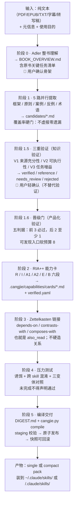

# cangjie-skill（仓颉）· 深层分析与接入选型

> 性质：调研账本 / 选型。
> 上位：[蒸馏方法论-开源参考地图.md](蒸馏方法论-开源参考地图.md) §6（其 6.3c 是本文摘要）；关联：[工具链-MCP与Skill地图.md](工具链-MCP与Skill地图.md) §2.6、[ADR 0009](../adr/0009-page-driven-agent.md) Phase 3。
> 回答一个问题：`kangarooking/cangjie-skill` 到底是什么、怎么运作、质量如何、装进本仓后怎么用、能借什么、不能替什么。
> 取材：GitHub 元数据 + 本地克隆逐行核对（`/home/dev_st/桌面/comtools/tmp/find-skills-2026-09-24/cangjie-skill`，HEAD `3adf9e6`，v2.5.0，2026-09-24）。下文 `路径:行号` 均指该克隆；**未验证的说法一律标「项目自称」**。

---

## 0 · 结论先行

| 问题 | 答案 |
|---|---|
| 是什么 | 一个**元 skill**：把书 / 长视频转写稿 / 播客 / 课程 / 访谈里的**方法论**，经七阶段流水线蒸成一组**可被 agent 触发的 Skill 包**。 |
| 不是什么 | 不是摘要器、不是读书笔记、不是知识卡生成器、不是人物扮演（`SKILL.md:3` 明写后者归 nuwa-skill）。**不做取材**：输入必须是纯文本。 |
| 与本仓「内容蒸馏」的关系 | 同一件事的两种产物：本仓六维卡**给人温故**，它的 Skill 包**给 agent 调用**。落在五步的 萃取 / 冷凝 / 复用，取材为零。 |
| 与本机旧 skill 的关系 | 记忆里的 `video-cangjie-distill` 就是它 v2「蒸馏视频」在 upstream WorkBuddy 机的安装名；**本机此前从未装过**（§8）。 |
| 质量 | 三轮盘点里最高：10.5K★ / MIT / 近 30 天 9 次提交 / 有 CI、unittest、确定性编译校验、真实示例产物 / 文档自我约束极严。 |
| 已做 | 2026-09-24 已把运行时部分装进 `.claude/skills/cangjie-skill/`（§6.3）。**未接进 `distill-template.js`**。 |
| 借什么 | RIA++ 六段（尤其 A2 触发场景、E 可执行步骤、B 边界）、三重验证四档分流、`importance_rationale` 必填、晋级门、DIGEST 还原自检——正对本仓「打分空白③」与 ADR 0009 Phase 3。 |
| 风险 | pyyaml 顶层硬依赖（缺则连 `doctor` 都崩）；`also_read` 编译零校验；装多本后 description 常驻膨胀；`books/` 工作目录是相对路径，装在项目里跑需约定（§9 待决）。 |

---

## 1 · 一句话概括 & 它解决什么问题

**一句话**：把一本书或一段长内容里「能照着做的方法」拆成一张张带触发条件、执行步骤和边界的能力卡，再编译成 agent 能调用的 skill，而不是写一篇读后感。

**解决的痛点**（`methodology/00-overview.md:23` 起「根本洞察」 + `SKILL.md:10` 使命）：读完一本方法论书，人记住的是「感觉」，agent 记住的是「摘要」，两者都**不能在下次遇到对应情境时被触发**。书摘是把 300 页压成 3 页，压缩比再高也只是短一点的原文；它要做的是**把「什么时候用、怎么一步步做、什么时候不该用」显式化**，让内容在真实任务里被调出来。

生活比喻：读书笔记是把菜谱抄进本子；它是把菜谱做成一台「看到这几样食材就自动亮灯、按步骤提示火候、遇到这几种情况提醒你别做」的厨房助手。

---

## 2 · 怎么工作的：七阶段流水线



**每阶段的入口、产物与硬闸门**（`SKILL.md:83-154`；断点续跑靠 `books/<slug>/PIPELINE_STATE.md`，`SKILL.md:85`）：

| 阶段 | 产物 | 最硬的一条闸门（原文） |
|---|---|---|
| 0 整书理解 | `BOOK_OVERVIEW.md`，含**原书关键任务清单**（task_id / 任务 / 原文位置 / 预期交付物 / 重要性及依据） | `methodology/01:45`「不从旧版 verified 反推清单」；`:53`「无证据时标记待核查，不编造三条批判」 |
| 1 并行提取 | `candidates/{frameworks,principles,cases,counter-examples,glossary}.md` | `methodology/02:43-44` 覆盖率硬门：「未解释遗漏先扩大窗口，仍漏则退回全量扫描；待核查不计作已覆盖」；`:90`「不做筛选——宁可多收有依据的候选」 |
| 1.5 三重验证 | `verified.md` / `references.md` / `needs-review.md` / `rejected/` / `coverage-audit.md` | `methodology/03:36`「纸面演练记录为 walkthrough，不是实际宿主执行。阶段 4 必须另测真实输出，未做时不能声称『已实测』」；`:69`「若没有任何 verified 候选，不为满足输出数量而凑 Skill」 |
| 1.6 晋级门 | `.cangjie/capabilities/destinations.json`（每个能力恰好一个去向：promoted / router） | `methodology/03b:42` 目标函数「用最少的可发现入口覆盖最多的高价值用户意图，同时不让任何能力失联」；`:40`「未晋级候选不进入 rejected/」 |
| 2 能力卡 | `cards/<slug>.md`（正文不带 frontmatter）+ `verified.yaml` 元数据 | `methodology/04:89`「importance … 不用出现频次代替重要性」；`SKILL.md:159`「A1 无原书案例时如实标注」 |
| 3 链接 | `also_read`、`GLOSSARY.md`；INDEX/路由表**由编译器生成，不手写**（`SKILL.md:141`） | `methodology/05:40`「宁可稀疏也不要制造虚假链接」；`:42` 10 个 skill 合理关系数 8–15 条 |
| 4 压力测试 | `test-prompts.json` + `test-results.md` | `methodology/06:74`「没有诱饵测试的 skill 一律打回」；`:76` 跨 skill 混淆为硬性要求；`:95`「没有数据不宣称非劣或提升」 |
| 5 交付 | `DIGEST.md` + 编译产物 + `BUILD_MANIFEST.json` | `methodology/07:14`「格式校验不能替代任务完成验证……只能生成明确标注的草稿，不能安装为已验收版本」；`:72`「不要同时安装同一本书的 single 和 pack」 |

**两条工程不变量**（`methodology/00-overview.md:81-91`）：**原子性**——一个能力只做一个方法论单元；**单一事实源**（ADR-002）——single 与 pack 从同一份 Capability Bundle 编译，生成目录只读，检测到本地手改不得静默覆盖（编译器强制三选一：`--force-overwrite` / 回填 Bundle 重编 / 中止，`scripts/cangjie_common.py:175`）。

---

## 3 · 输出结构：Capability Bundle → single / pack

**Bundle 是唯一事实源**（`books/<slug>/.cangjie/capabilities/`）：`verified.yaml` + `cards/*.md` + `destinations.json` + `book/{overview,glossary}.md`。schema 顶层 required（`schemas/capability-bundle.schema.json:7`）：`schema_version / bundle_id / book / entry / router_entry / promotion_budget / capabilities`；每个能力 required（`schemas/capability.schema.json:7`）：`capability_id / revision / status / slug / title / importance / importance_rationale / one_liner / intents / keywords / card`。`importance_rationale` 要求 `minLength: 8`，描述原文「必须附依据……不得纯自评」（`:19`）。

**RIA++ 六段能力卡**（`templates/SKILL.md.template`）：

| 段 | 填写指令（原文节选） |
|---|---|
| R 原文 | 「≤150 字（英文 ≤100 词），必须标注章节/页码/时间戳」（`:24`） |
| I 方法论骨架 | 「用自己的话重写，5-15 行。读完这段，一个没读过原书的人应当能理解……禁止照搬原文，禁止堆砌修辞」（`:32-34`） |
| A1 应用示例 | 「无原书案例则写『原书未提供，以下为合成演练』」「不编造作者经历」（`:41-42`） |
| **A2 触发场景 ★** | 三件套：情境 3~5 条 / **语言信号**（中英双写）/ **与相邻 skill 的区分**（`:54-69`） |
| **E 可执行步骤** | 「必需输入：字段、类型、单位、适用条件；缺失时询问什么」「交付物与完成标准」；每步带「完成标准」与「判停条件」（`:75-85`） |
| **B 边界 ★** | 四小节：不要在以下情况使用 / 作者警告的失败模式（来自反例提取器）/ 作者的盲点与时代局限 / 容易混淆的邻近方法论（`:94-107`） |
| 相关 skills / 审计 | `depends-on / contrasts-with / composes-with`；V1✓V2✓V3✓ + 测试通过率 + 蒸馏时间（`:113-125`） |

**三个容易混的词**（v2.5）：`compile --output auto|single|pack` 是顶层输出模式（`scripts/cangjie.py:272`）；**single** = 一个路由入口承载整本内容；**pack** = 一个路由入口 + 少数晋级为独立 Skill 的能力 + 内部能力卡；**router** 不是输出模式，是 pack 里那个路由入口的编译视图（`scripts/compile_single.py:13,215`）。`auto` 默认 single-first（`select_output_strategy.py:5-8`），需用户轻确认后加 `--yes`。

**编译链路的工程保护**（`scripts/cangjie.py:160-191`、`cangjie_common.py:116-203`）：per-run workdir → staging 目录先过 `validate_skill_pack.py` 硬门（不过则保留 staging 不发布）→ WriterLock（同一目标同时只允许一个 writer）→ 发布前快照 `snapshots/<时间>-pre-<run_id>/` → 原子 rename 发布，失败回滚 → 写 `BUILD_MANIFEST.json`（含 bundle sha256、variant、发布哈希）。`rollback --list / --to` 恢复任一快照，恢复前再打一次 `pre-rollback` 快照。CI 里有「同一 Bundle 重复编译字节一致」的确定性冒烟（`.github/workflows/pipeline-check.yml`，克隆里可见，未 vendor）。

---

## 4 · 质量机制拆解（它比多数「蒸馏器」多出来的那一层）

1. **三重验证是「任务优先」而非「新颖优先」**（`methodology/03:8` 明写废止旧判据）：V1 问「可定位的原文是否足以支持」——一处完整说明即可通过，重复转述不算独立证据；V2 问「换一组合法输入能否完成任务并检验」——不要求跨域迁移；V3 问「固化后给任务带来什么可检查的帮助」——不要求作者独创。四档去向：`verified` 进晋级门；`reference` 落 overview/glossary 参考区并登记路径；`needs_review` 列缺口不进能力池；`rejected` 附理由。硬句：「重要但待核查的内容不能静默消失……用户确认只确认范围，不能替代来源或执行验证」（`:58`）。
2. **晋级门把「知识对」和「值得成为入口」分开**（`methodology/03b`）：独立意图 / 独立契约 / 独立运行 必过，独立复用 / 独立评测 至少一条；入口软预算 8。动因是真实反馈：《纳瓦尔宝典》样本曾产出 19 个 Skill，读者嫌多（`03b:9-11`）。
3. **重要度不能靠出现次数**：`importance` 四档 + `importance_rationale` 必填且须引依据（图入度 / DIGEST 篇幅 / 任务集命中 / 读者任务映射），上游是阶段 0 的任务清单，下游反向驱动覆盖审计（`03:66`「对 critical/high 任务逐项复核」）。
4. **压力测试拒绝自评**（`methodology/06`）：`should_trigger` 3–5 / `should_not_trigger` 2–3 / `edge_case` 1–3；诱饵里至少一条「应触发同书另一个 skill」；train/validation 60/40 固定种子，validation 选版前隐藏；三变体 `old_skill / new_skill / without_skill` 同宿主同输入对照；退出码 0 只证明机械断言，「不替代来源核查或语义评估」（`:107`）。
5. **DIGEST 是给人的还原测试**（`methodology/07:54-58`）：「没读过原书的人读完能复述主旨、3 个以上核心方法论、2 个以上陷阱」「没有未通过三重验证的内容被当核心方法论呈现」「有批判/局限部分，不是全程吹捧」「每个方法论小节都有 skill 链接」。`:47`「只报喜不报忧的精华是软文，不是蒸馏」。
6. **文档层的自我约束密度**是它区别于同类的最直观信号：「不凭记忆拆书——没文本就停下来问」（`SKILL.md:180`）、「不能用收尾模板掩盖缺口」（`07:82`）、「合成基准，不是已验证修复」（`06:108`）、「任何情况下都不得在用户不知情时上报使用数据」（`03b:52`）。

---

## 5 · 与本仓六维的逐维对照 · 可借清单

| 本仓六维（`js/core/distill-template.js`） | cangjie 对应 | 差距 | 可借的具体条款 |
|---|---|---|---|
| 核心观点（1 条 ≤20 字） | I 骨架 + `one_liner` | 相当；它多一条验收：「没读过原书的人能否理解」 | 把这句验收加进核心观点约束 |
| 方法步骤（3~7 条动词开头） | E 可执行步骤 | **它远强** | 每步「完成标准」；「必需输入：缺失时询问什么」；「判停条件」 |
| 适用场景（2~4 条） | A2 触发场景 | **它远强** | 「语言信号」（用户会怎么说）+「与相邻卡的区分」两小节 |
| 边界反例（≥1 条） | B 边界 + 专职 `counter-example-extractor` | **它远强** | 反例四字段 `failure_mode / mechanism / warning_signs / bound_to`（`extractors/counter-example-extractor.md:39-59`）；B 段「作者的盲点 / 时代局限」 |
| 可复用动作（1~5 条） | E + 随包 `resources/`（脚本/模板，只复制不执行） | 相当 | — |
| 出处（作者+链接+引文/时间点） | R 原文 + `source_evidence` | 相当；它的时间戳来自输入转写稿、自己不生成 | 「视频填时间戳或分 P，播客填集数」（`SKILL.md:54`） |
| **本仓没有的** | A1 案例（强制标「原书未提供 / 合成演练」）；Zettelkasten 三类关系；跨卡混淆测试；**四档打分 + `importance_rationale` + 反凑数红线**；**DIGEST 还原自检** | 空白③（打分）与 ADR 0009 Phase 3 缺的正是这层 | 先只借「四档去向 + importance 必附依据」两条进六维模板；打分自动化仍守心法「人在环中」 |

对照的边界：**它蒸的是「方法论」**（`SKILL.md:17` ✅ 做「方法论 / 决策框架 / 操作流程 / 计算规则 / 排障 / 清单 / 原则」），本仓卡还要装「观点 / 事实 / 案例」类干货——两者不是替代关系。

---

## 6 · 应用场景 · 什么时候不适合用 · 怎么用

### 6.1 谁真的需要它
1. 读完一本方法论书（《纳瓦尔宝典》《原则》类），想让 agent 以后在对应情境里**自动用上**，而不是自己再翻笔记。
2. 一门几十讲的课程或一场三小时访谈的转写稿，想拆成十来个可单独触发的操作卡，并知道每张卡「什么时候别用」。
3. 团队内部的 SOP 长文档，想变成 agent 可调用、可测试、可回滚的 skill 包，而且要求每条结论能回溯到原文段落。
4. 想给自己的六维模板补「打分与验收」工艺——把它当方法论参考而不跑它。

### 6.2 什么时候不该用（`SKILL.md:18`、`:3`）
- 只想要一篇摘要、书评、读后感——它明说 NOT for simple summarization。
- 想让 agent「像作者一样说话」——那是 nuwa-skill 的活。
- **手里只有视频链接、没有转写稿**——它不取材，会停下来向你要文本。
- 内容是叙事 / 情绪 / 体验型（小说、vlog）——没有可执行方法论，三重验证会全部落到 `reference` 或 `rejected`，它自己也会「不凑 Skill」。
- 一次想装十几本书——issue #20：每本一个常驻 description，宿主上下文会膨胀；`single` 模式一本只占一个入口，是它给的缓解。

### 6.3 怎么用（本仓）
- **已装位置**：`.claude/skills/cangjie-skill/`（2026-09-24，源 `3adf9e6`）。只 vendor 运行时：`SKILL.md`、`methodology/`（9 份）、`templates/`（5）、`extractors/`（5）、`scripts/`（18 个 py，2,926 行）、`schemas/`（13）、`docs/`、`tests/`、README×3、LICENSE、CHANGELOG；**排除** `.git .github assets/（4.7MB star 图）website/ benchmarks/ dist/ registry/ books/`（示例产物）。共 740K / 71 文件。
- **触发**：按 description 原文说「拆书 / 蒸馏一本书 / 把 XX 书做成 skill / 把这个视频（播客、课程）蒸馏成 skill」。它会先要四样（`SKILL.md:48-52`）：文本来源、元信息、使用目的（学习/查阅 → single；接工作流 → pack）、是否首次试点（首次建议只蒸 1 份）。
- **自检**（我跑过，PASS）：
  ```bash
  /home/dev_st/iriswork/tools/anaconda/bin/python .claude/skills/cangjie-skill/scripts/cangjie.py doctor
  ```
- **编译交付**（`SKILL.md:152` 原句，路径相对 skill 目录）：
  ```bash
  python3 scripts/cangjie.py compile --bundle books/<slug>/.cangjie/capabilities --out <目标目录> --output auto
  ```
  `auto` 会打印决策报告并退出码 2 等你轻确认，确认后加 `--yes` 或显式 `--output single|pack`（`scripts/cangjie.py:160-162`）。
- **配套取材**（它不做）：图文用本机 `baoyu-url-to-markdown`；YouTube 用 `youtube-transcript`；B 站 / 抖音 / 小红书见 [蒸馏方法论-开源参考地图.md](蒸馏方法论-开源参考地图.md) §6.4 的两个未拍板候选（chubbyskills 轻、video-downloader 重而全）。
- **与六维卡的分工**：同一份转写稿，要「以后温故」走工作台蒸馏库出六维卡；要「以后让 agent 用」走它出 skill 包。两条线**不接线**，避免把 skill 包当卡入库或反过来。

---

## 7 · 风险与硬伤（均已定位到代码）

| # | 问题 | 位置 / 证据 | 影响 | 应对 |
|---|---|---|---|---|
| 1 | **pyyaml 顶层硬 import**，缺失时任何子命令（含 `doctor`）在 import 阶段就崩，`doctor` 里那条 `[FAIL] yaml 缺失` 永远到不了 | `scripts/cangjie_common.py:18`；`cangjie.py:27-38` vs `:48-54`；CI 用 `doctor \|\| true` 吞掉（issue #29 open） | 本机 anaconda 环境 pyyaml 6.0.2 在位，不触发 | 换 python 解释器前先 `import yaml` |
| 2 | **`also_read` 编译零校验**：schema 只约束「字符串数组」；编译器唯一消费点把元素直接当 slug 拼路径；router 视图下晋级能力的 `also_read` 被整句替换而丢弃；断链只在 staging 硬门以 `[broken-ref]` 报出且不指向 `also_read` | `schemas/capability.schema.json:23`；`scripts/compile_single.py:97-99`；`validate_skill_pack.py:44-56`（issue #30 open） | 阶段 3 若写成 `cap.xxx` 会产死链，报错难定位 | 阶段 3 只填 slug；编译失败先查 `also_read` |
| 3 | 装多本后 description 常驻膨胀 | issue #20；`methodology/07:72` 只给「single/pack 二选一」缓解 | 宿主上下文成本 | 一本一 single；控制总数 |
| 4 | `books/<slug>/` 与 `scripts/cangjie.py` 全是**相对路径**，SKILL.md 未定义工作目录 | `SKILL.md:59,85,91,106,132,140,151-152` | 装在项目里跑，产物可能落在仓根或 skill 目录，被门禁/提交波及 | §9 待决①：约定目录并决定是否 gitignore |
| 5 | 安全审计 | 克隆全文 grep：出网仅 README 的 DeepSeek 插件 `curl -fL` + `shasum -a 256 -c`（用户手动）与 `scripts/generate_star_history.py`（CI 专用，未 vendor 其 workflow）；`subprocess` 只调自家脚本；无 API key、无硬编码绝对路径、无 `/tmp` 落盘（仅文档示例）、无 `curl \| bash`、无静默自检出网 | 无 | 通过 |
| 6 | 示例产物已过时 | `books/naval-almanack-skill/verified.md:3` 仍是旧三关命名「V1 跨域 / V2 预测力 / V3 独特性」；缺 `coverage-audit.md` 等 2026-09-13 新增产物 | 学样例时别照抄旧结构 | 以 `methodology/03` 现行判据为准 |
| 7 | 成本 | 项目自称阶段 1 派 5 个并行子代理、阶段 4 三变体评测；真实 Token 未作承诺（ADR-001 `docs/plans/...:1776`） | 一本书一次可能不便宜 | 先「试点 1 本」（`SKILL.md:52,178`） |

---

## 8 · 来源与考古

**来源等级**：
- A 级（原文核对）：本地克隆 `3adf9e6` 全部引用；GitHub API 元数据（star 10,510 / fork 1,223 / created 2026-04-16 / pushed 2026-09-13）；commits atom（近 30 天 9 次）。
- B 级（原文可见但未跑）：CI workflow、benchmarks 报告、issues 页面（#13 / #20 / #29 / #30 内容为页面原文）。
- C 级（项目自称）：「顶级模型单次成本」「600 秒目标」等性能与成本表述。

**同源考古**（本仓 git 历史 + upstream 快照）：本仓是 `Zero-st/DailyWorkbench` 的快照 fork（`b63fce5`，2026-08-26），upstream 是 WorkBuddy 环境。快照随附、后于 `c7b14ad` 删除的 `mobile/assets/skill_lib.json` 三处点名 `cangjie-skill`：`workbuddy-bluebook` 的 `related_skills`、「案例 2：把书/视频蒸馏成 Skill（Ch22）：用 cangjie-skill（v1 蒸馏书、v2 蒸馏视频）」、以及与其「蒸馏引擎」的区分说明；`cs-learning` 亦记「四篇笔记用 cangjie-skill 思路于 2026-08-08 批量蒸馏」。快照里的按钮指令「用 video-cangjie-distill 把以下视频转成 skill」（`app.js:957`）在 fork 当天 `865a561` 被换成「用 creator-video-decoder 拆解以下视频，输出六维拆解报告」——**换的不只是名字，是产物语义（skill → 六维报告）**。两个名字在本机 `find` 均零命中（2026-09-04 校准），本仓 `platforms.js:9` 早已把视频分支拆绑为「用可用工具取字幕」。结论：`video-cangjie-distill` = cangjie-skill v2 的 upstream 安装名；它从未装在本机；它当年被换掉的结构性原因是**产 skill 而非 transcript**，与今天「不接进 distill-template」的决定一致。

**活的残留**：`js/views/dash.js:12` 仍向用户输出「用 creator-video-decoder 拆解以下视频…」死指令，IA 重构漏删的最后一处；修它要动前端资产（`bump_version.py`），另开一轮。

---

## 9 · 采纳 / 不采纳

| 项 | 决定 | 理由 |
|---|---|---|
| 装 cangjie-skill 本体到项目 `.claude/skills/` | **采纳（已做）** | 质量最高；MIT；纯 stdlib + pyyaml；零网络零 key；删目录即回滚；用途真实且与知识卡互补；upstream 机器就是这么并用的 |
| 接进 `distill-template.js` / `platforms.js` | **不采纳** | 它产 skill 包，视频分支要的是 transcript → 六维卡；接线会把两种产物混进蒸馏库 |
| 借 RIA++ A2 / E / B 条款与「四档去向 + importance 必附依据」进六维模板 | **采纳（待做，ADR 0009 Phase 3 一并）** | 正对空白③；条款粒度小、可逆 |
| 借 DIGEST 四条自检当卡片验收 | **采纳（待做）** | 与本仓「还原测试」同一原理，且写得更具体 |
| 装同作者 `video-downloader` 补取材 | **待决** | 多平台含小红书/视频号，但先下整段视频 + ffmpeg，比 chubbyskills 重；两者二选一时再核真机 |
| 待决① `books/<slug>/` 工作目录约定 | **待决** | 建议：沿用上游布局落在 `.claude/skills/cangjie-skill/books/`，并将其加入 `.gitignore`（审计层体量大、含原文引用）；编译产物 `--out` 指向 `.claude/skills/<book-slug>/` 才入仓。改 `.gitignore` 属配置变更，由用户拍板 |
| 修 `dash.js:12` 死指令 | **待决（另开一轮）** | 前端资产变更，需 `bump_version.py` 与走查 |

---

## 10 · 变更记录

| 日期 | 改了什么 | 为什么 |
|---|---|---|
| 2026-09-24 | 首版：深层分析 + 安装记录 + 采纳表 | 用户点名并拍板「直接安装到项目，深层次分析」 |
