# DailyWorkbench 产品 / 信息架构(IA) 评审

> 版本：v1.0　制定：2026-08-31
> 定位：诊断"**产品/模块/信息架构不合理**"到底不合理在哪，给出可执行的重构提案。
> 性质：**评审 + 提案**——不替你拍板砍谁，决定权留给下一步 `/brainstorming` 重想方向。
> 关联：`界面设计准则.md`（视觉层，已做）、`知识飞轮-路线图.md` / `项目总览-需求与进度.md`（需求/方向，评审后回写）。
> 方法：Nielsen 十大可用性启发式 + Krug《别让我思考》+ `design-principles` 模块边界卡；范围＝**IA/模块/分组/产品定位，不含视觉**（视觉归 `界面设计准则.md`）。

---

## 0 · 一句话诊断

**你的问题不是"界面丑"（那已在 `界面设计准则.md` 修），是"信息架构过度碎片化 + 模块重叠 + 分组错配"。**

13 个侧边栏入口里，**只有约 5 个是你每天真会用的**（今日 / 资讯 / AI助手 / 知识库 / 蒸馏库），其余 8 个是"偶尔瞄一眼"或"设一次就不碰"。对照 Nielsen 第 8 条**「美学与极简」**和 Krug**「别让我思考」**——过多同质入口本身就是认知负担：用户每次都要在 13 个里判断"我该点哪个"，而其中一半在讲同一批数据。

---

## 1 · 逐模块诊断（13 个视图）

用频：🟢日用 / 🟡偶尔 / 🔴罕见（设一次）。严重度：🔴高 / 🟡中 / ⚪低。

| # | 模块 | 现状功能 | 数据源 | 用频 | 问题 | 建议 | 严重 |
|---|---|---|---|---|---|---|---|
| 1 | **今日 home** | todo（增/勾/清）+ 番茄钟 + 今日复盘（完成率/最近会话/自由文本→存库） | localStorage + data.json + `/api/kb/save` | 🟢 | 飞轮的"捕获+复盘"核心，但和 dash 的今日微数据重叠 | **保留**（做捕获中枢，吸收 dash 的速记/收藏/入口） | — |
| 2 | **仪表盘 dash** | 6 KPI 卡 + skill 搜索 + 快捷启动 + 今日速览 + bento(速记/计数/收藏/入口) | data.json + localStorage | 🟡 | KPI 是 ov 的**薄摘要**（还深链进 ov 卡）；今日微数据与 home 重叠；"生成建议"与 cap 重复 | **拆解**：交互件(速记/收藏/入口)并入 home；KPI 降为页眉条或并入单一概览 | 🔴 |
| 3 | **本周动态 week** | 本周系统变更流(skill/kb/model/automation) + 类型筛选 | data.json `.weekly` | 🟡 | 与 sess 都是"最近发生了什么"时间线，两个近似列表 | **合并进 sess**（统一"动态"） | 🟡 |
| 4 | **会话档案 sess** | 会话搜索 + 最近列表 + 17 周热力图 + 全量归档 | data.json `.sessions` | 🟡 | 自身就是同一 sessions 的 3 种呈现；与 week 同类 | **保留并吸收 week**，收敛呈现 | 🟡 |
| 5 | **能力速达 cap** | skill 分类速查 + 点击复制调用指令 + 引导/生成建议侧栏 | data.json `.skills`/`.guide` | 🟢 | "生成建议"与 dash 重复；已含 🔥usage 徽标 | **保留**（吸收 stats 的 usage 分析） | ⚪ |
| 6 | **资讯 info** | AI 日报 + 每日新闻 feed（历史日期/展开/收藏/让AI讲/存库） | data.json `.aiDaily`/`.dailyNews` | 🟢 | **错分在「能力」**——它是被动输入 feed，不是能力/工具 | **保留，改分组**到"输入" | 🔴(分组) |
| 7 | **AI 助手 ai** | 完整聊天 + 记忆管理 + @kb 引用 + 存库 | localStorage + `/api/chat`/三方 LLM + `/api/kb` | 🟢 | 飞轮"加工/输出"核心 | **保留** | — |
| 8 | **模型管理 models** | 模型配置 CRUD + 设为活跃 + API key | Supabase `/api/models` + localStorage 兜底 | 🔴 | 一次性**配置**，却占日常导航一等位 | **降级**为设置入口（齿轮/设置区） | 🟡 |
| 9 | **知识库 kb** | Obsidian 浏览/阅读(双链/标签)/全文检索 + 存库 | Obsidian `/api/kb/*` | 🟢 | 飞轮"沉淀"核心 | **保留**（吸收 ov 的"内容与知识生产"卡） | — |
| 10 | **蒸馏库 distill** | 经验卡工作台：链接→六维指令→粘回→存卡→筛选/阅读 | `/api/kb/*` Obsidian | 🟢 | 飞轮"蒸馏"核心（刚做完 UI） | **保留** | — |
| 11 | **系统状态 ov** | 4 卡：个人状态/环境体检/自动化编排/内容与知识生产 | data.json `.status`/`.knowledge`/`.kpi` | 🔴 | KPI 与 dash 重复；"内容与知识生产"与 kb+distill 重复 | **瘦身**：KPI→归一；kb 卡→并入 kb；保留环境体检/自动化 | 🟡 |
| 12 | **Skill统计 stats** | 3 卡：装/用/总量 + TOP10 柱状 + 分类分布 | data.json `.skills[].usage` | 🔴 | 全 app **最薄(35 行)**；是 cap 已展示 usage 的一个切面 | **合并进 cap** | 🟡 |
| 13 | **课程表 schedule** | 课表导入/增删/导出/GitHub 备份 | localStorage + GitHub API | 🔴 | **完全跑题**——学生课表和 AI 知识工作台无关 | **砍掉或 spin-out** 独立小工具 | 🔴(定位) |

**结论**：13 个里，飞轮脊柱 5 个(home/info/ai/kb/distill) + 启动器 1 个(cap)＝**6 个真正一等公民**；dash/week/sess/ov/stats 是**机器遥测**（该收敛）；models 是**配置**（该降级）；schedule **离题**（该拿走）。

---

## 2 · 重叠 / 冗余（Nielsen「一致性」+ DRY）

**A · 遥测四件套 dash / ov / stats / week 严重重叠**
- `kpi.skills/knowledge/memory` + 磁盘数：在 **dash KPI 卡**、**ov**、**stats** 各出现一次；dash 的 KPI 卡甚至**深链进 ov 的卡**（`tab:"ov"`）——等于官方承认 dash 是 ov 的薄摘要。
- **ov「内容与知识生产」**卡（kb 文件数/类型 + 蒸馏按钮）**重复** kb 与 distill。
- **stats** 是 cap 已用 🔥 展示的 `.skills` usage 的一个下钻切面，是全 app 最薄的视图。
- **week vs sess**：都是 data.json 里的"最近活动"时间线，呈现近乎两份同类列表。

**B · home ↔ dash 今日微数据重叠**
- home 出 todo+复盘；dash 的 bento 又出速记/收藏/**todo+note+fav 计数**；"生成今日建议"在 dash(`inspireToday`) 与 cap 侧栏各一份、**文案相同**。

> 修法：遥测归一——`stats→cap`、`week→sess`、`ov 的 kb 卡→kb`、`ov/stats 的 KPI→单一概览`；今日微数据全归 home。洞察+系统 5 个只读板 → 收敛到 ~2。

---

## 3 · 分组错配（Nielsen「匹配真实世界」）

现状 5 组：今日 / 洞察(dash·week·sess) / 能力(cap·info·ai·models) / 知识(kb·distill) / 系统(ov·stats·schedule)。

- ❌ **资讯 info 分到「能力」**——最明显错分。它是被动新闻 feed，不是能力/工具，应归"输入"。
- ❌ **models 在「能力」**——是一次性配置，不是日常能力，应进"设置"。
- ❌ **stats 在「系统」**——是 skill 分析，属"洞察"，且本就该并进 cap。
- ❌ **schedule 在「系统」**——课表和工作台无关，该拿走。
- ✅ 洞察(dash/week/sess) 组内自洽，但 dash 因携带今日微数据而横跨"今日/洞察"。

---

## 4 · 建议的重构 IA（提案，非拍板）

**原则**：侧边栏顺序 = 你的知识飞轮顺序，让"该点哪个"不用想（Krug）。从 13 收敛到 **~7**。

```mermaid
flowchart LR
  subgraph NOW["现状 · 5 组 / 13 视图（碎片化）"]
    direction TB
    n1["今日: home"]
    n2["洞察: 仪表盘 · 本周动态 · 会话档案"]
    n3["能力: 能力速达 · 资讯 · AI助手 · 模型管理"]
    n4["知识: 知识库 · 蒸馏库"]
    n5["系统: 系统状态 · Skill统计 · 课程表"]
  end
  subgraph NEW["提案 · 按飞轮 / ~7 视图"]
    direction TB
    m1["① 今日 home ＝ 捕获+复盘中枢<br/>(吸收 dash 的速记/收藏/入口)"]
    m2["② 资讯 info ＝ 输入"]
    m3["③ 知识库 kb ＝ 沉淀<br/>(吸收 ov 内容生产卡)"]
    m4["④ 蒸馏库 distill ＝ 蒸馏"]
    m5["⑤ AI 助手 ai ＝ 加工/输出"]
    m6["⑥ 能力速达 cap<br/>(吸收 Skill统计)"]
    m7["⑦ 动态 sess<br/>(吸收 本周动态)"]
    s1["⚙ 设置: 模型管理 · 系统状态(环境/自动化)"]
    x1["✂ 课程表 → 砍/独立小工具"]
  end
  NOW --> NEW
```

要点：
- **飞轮主轴一等公民**：今日(捕获+复盘) → 资讯(输入) → 知识库(沉淀) → 蒸馏库(蒸馏) → AI助手(输出)，加 能力速达(启动器)、动态(回顾)。
- **合并**：Skill统计→能力速达；本周动态→动态(会话档案)；系统状态「内容生产」卡→知识库；dash 的 KPI→归一到单一概览或页眉、交互件→今日。
- **降级**：模型管理 + 系统状态(环境体检/自动化编排) 收进"设置"，不占日常导航。
- **拿走**：课程表 spin-out 或砍。

---

## 5 · 优先级（改动小 × 收益大 × 可逆 先做）

| 优先 | 动作 | 代价/门 |
|---|---|---|
| 1 | **资讯 re-home** 出「能力」到"输入" | 极小，纯分组，双向门 |
| 2 | **Skill统计→并入 能力速达** | 小，stats 仅 35 行，双向门 |
| 3 | **本周动态→并入 会话档案(动态)** | 小-中，双向门 |
| 4 | **系统状态瘦身**：KPI 归一、kb 卡并入知识库 | 中，双向门 |
| 5 | **dash 拆解**：交互件并 home、KPI 降级 | 中，需想清"概览"落点 |
| 6 | **模型管理/系统状态 收进设置** | 中，导航改版 |
| 7 | **课程表 砍/spin-out** | 需**你拍板**（可能你确实在用）|

> 1-3 是低代价双向门，随时可回退，适合先试水；5-7 牵扯较大，建议 `/brainstorming` 定完方向再动。

---

## 6 · 下一步

进 `/brainstorming` 回答三问——**这个工作台为谁、解决什么、该留哪几个模块**——把本评审当输入，产出方向共识后回写 `知识飞轮-路线图.md` / `项目总览`，再决定实际重构哪几步。**本评审不改任何代码。**

---

## 7 · 变更记录

- 2026-08-31 · v1.0 · 初版：13 模块逐一诊断 + 遥测/今日重叠 + 分组错配 + 收敛到 ~7 的重构提案 + 优先级。缘起：用户感到产品/IA 不合理；确认 spec-kit 不适用，用 Nielsen/Krug/design-principles 方法做评审。
- 2026-08-31 · v1.1 · **提案已落地**（见 CHANGELOG v0.7.0）：侧边栏 13→9（今日 / 飞轮 / 工具 / 设置）。dash 拆解（交互件并入今日、KPI/今日速览删除）、stats→cap、week→sess、ov 内容生产卡→kb、models+ov 降级设置、资讯 re-home 到飞轮、课程表下架（代码保留）。Chrome 真机走查全绿（9 视图 + 温故卡/搜索/技能点击/周变更筛选交互均通过，无 console 报错）。
- 2026-09-01 · v1.2 · **MVP 进一步收敛 9→6**（见 CHANGELOG v0.8.0）：本评审判定为"机器遥测"的 ov/sess/cap 三件套从导航下架（只留飞轮五件 + 设置·模型管理），代码/数据全保留（双向门可恢复）。至此评审提案（收敛到飞轮主轴）完全落地。
